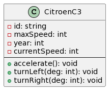

<!-- <style>
  /* this works for export */
  @import url( "/home/david/Documents/teaching/POO/CM/POO/themes/custom.css" );
  /* this works in preview */
  @import url( "./themes/custom.css" );
</style>
 -->

<!-- PARTIE 0 : Présentation du cours -->

<!-- _paginate: skip -->


<!-- TABLE DES MATIERES -->
--- 

## Table des matières 

<b><span class="important">01 </span> Objets et classes</b>
Attributs et méthodes. Instances.


<b><span class="important">02 </span> Encapsulation</b>
Données privées, publiques.


<b><span class="important">03 </span> Constructeur / Destructeur</b>
Constructeur par défaut. Constructeur par recopie.

<b><span class="important">04 </span>Le mot clé: <span class="important">self</span></b>


---
<!-- PARTIE 1 : OBJETS ET CLASSES -->

<div class="main">

# 01 

## Objets et classes

</div>

---

## Objets et classes

<b class="important">Définitions</b>

Un **objet** est une variable. Il faut notamment qu’il soit déclaré avec son type. Le type d’un objet est un type composite (constitué de types primitifs, de fonctions et d’autres objets) => appelé **classe**.

Un **objet** n’est autre qu’une **instance de classe**.

Un **classe** est un **type de données** (au même titre que les entiers, les chaînes de caractères, etc).

Une **classe** regroupe un ensemble de choses:
- des données que l’on appelle **attributs** (variables primitives ou objets) 
- de **méthodes** de traitement de ces données et/ou de données extérieures à la classe


---

## Objets et classes

<b class="important">Différence classe et objet</b>

Il n’existe qu’une classe CitroenC3 mais il peut exister de nombreuses instances de cette classe.
```python 
voitureDidier : CitroenC3 = CitroenC3()
#------------   ---------   -----------
#   objet        classe     constructeur
```

<br/>

<div class="block note">

# Pour mieux comprendre

**Classe =** Le moule pour fabriquer des objets = type de données contenant des données (attributes) et des fonctions (méthodes)

**Objet =** une instance de classe (l’objet une fois créé) = une donnée spécifique

</div>


---

## Définir une classe

<div class="flex-horizontal">
<div class="flex">

<b class="important">Syntaxe UML</b>



</div>
<div class="flex">

<b class="important">Syntaxe python</b>

```python
class CitroenC3:

    # Constructeur
    def __init__(self):
        self._id = 0
        self._currentSpeed = 0 
        self._maxSpeed = 210
        self._year = 2010

    def accelerate(self):
        pass

    def turnLeft(self, deg):
        pass

    def turnRight(self, deg):
        pass

```

</div>
</div>


---

## Instancier un objet

<div class="flex-horizontal">
<div class="flex">

<b class="important">Syntaxe UML</b>

<!--  -->

</div>
<div class="flex">

<b class="important">Syntaxe python</b>
Pour instancier un objet en python on fait appel au constructeur.

```python
maVoiture = CitroenC3()
```

</div>
</div>

---
<!-- PARTIE 2 : ENCAPSULATION -->

<div class="main">

# 02 

## Encapsulation

</div>

---
## Encapsulation 
<b class="important">Princpe</b>

<!-- _backgroundImage: url(./assets/img/bg4.png) -->

<div class="flex-horizontal">
<div class="flex">

Usage simple et visible 


</div>

<div class="flex">

Fonctionnement complexe et caché


</div>
</div>


---

## Encapsulation

<b class="important">Visibilité des données</b>

Lors de la conception d’un programme orienté-objet, le programmeur doit:
- identifier les objets et les données appartenant à chaque objet
- les droits d’accès qu’ont les autres objets sur ces données

L’encapsulation de données dans un objet permet de cacher ou non leur existence aux autres objets du programme. Une donnée peut être déclarée en accès :

- **public** : les autres objets peuvent accéder à la valeur de cette donnée ainsi que la modifier

- **privé** : les autres objets n’ont pas le droit d’accéder directement à la valeur de cette donnée (ni de la modifier). En revanche, ils peuvent le faire indirectement par des méthodes publiques de l’objet concerné


---

## Encapsulation

<b class="important">Bonnes pratiques</b>

- ne rendre publique que le stricte minimum
  - les fonctions nécessaires à l’usage (`accelerate`, `turnLeft`, `turnRight`)
  - et pas plus (`increaseSpeed`, `turnLeftWheel`) 
- suivre le principe de **responsabilité unique** - **S** de **S**OLID
    - exemple [Animal / AnimalDB](https://gist.github.com/dmmeteo/f630fa04c7a79d3c132b9e9e5d037bfd) 
- n’utiliser que des **attributs privés** donc, si c’est raisonnable de penser qu’on a besoin:
    - de lire leur valeur depuis l’extérieur, on utilise un **getter**
    - de modifier leur valeur depuis l’extérieur, on utilise un **setter**


---

## Encapsulation

<b class="important">Syntaxe python</b>


---
<!-- PARTIE 3 : ENCAPSULATION -->

<div class="main">

# 03

## Constructeur

</div>

---
<!-- PARTIE 4 : SELF -->

<div class="main">

# 04

## Le mot clé : **self**

</div>
