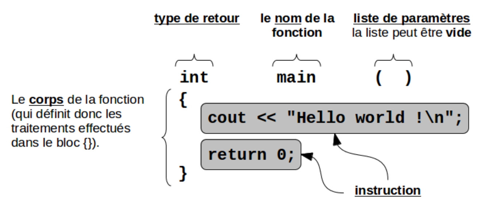
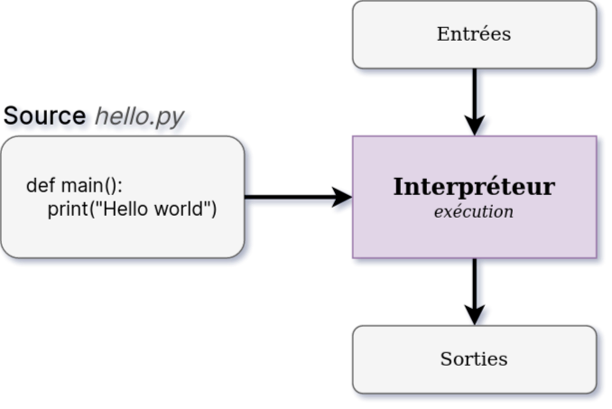
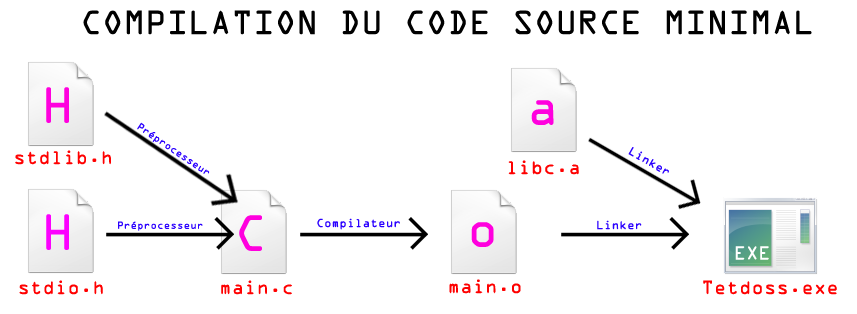

<!-- PARTIE 0 : Présentation du cours -->

<!-- _paginate: skip -->
<!-- _class: cover -->

<div class="coverBlockCenter">
<div class="coverModuleName">Programmation C / C++</div>
<div class="coverCourseName"><span class="important">#1 </span>Compilation</div>
<div class="coverAuthor">par <span class="important">David Albert</span></div>
</div>


<div class="coverYear coverFooterRight">2024</div>

<!-- TABLE DES MATIERES -->

---

## Table des matières

<b><span class="important">01 </span> Premier programme</b>
Programme principal. Suite d'instructions.

<b><span class="important">02 </span> Chaîne de compilation</b>
Etapes de compilation. gcc. g++.

<b><span class="important">03 </span> Préprocesseur</b>
Définition de macros. Compilation conditionnelle.

<!--
<b><span class="important">03 </span> Etape 2 : Compilation</b>

<b><span class="important">04 </span> Etape 3 : Assemblage</b>

<b><span class="important">05 </span> Etape 4 : Edition des liens</b> -->

---

<!-- PARTIE 01 : Premier programme C++ -->

<div class='main'>

# 01

## Premier programme

</div>

---

## Premier programme C++

Voici un exemple de programme écrit en C++.

```cpp
// Ce programme affiche le message "Hello world !" à l’écran
#include <iostream>

int main()
{
    std::cout << "Hello world !\n"; // Affiche "Hello world !"
    return 0;
}
```

<div class='flex-horizontal'><div class='flex'>



</div><div class='flex'>

<div class='block warning'>

<i class='block-icon fas fa-exclamation'></i>

Tout programme C/C++ doit posséder une (et une seule) fonction nommée **_main_** (dite fonction principale) pour **indiquer où commencer l’exécution**.

</div>
</div></div>

---

## Equivalent en C

Voici un exemple de programme écrit en C.

```cpp
// Ce programme affiche le message "Hello world !" à l’écran
#include <stdio.h> /* pour printf */

int main()
{
    printf("Hello world !\n"); // Affiche "Hello world !"
    return 0;
}
```

---

<!-- PARTIE 01 : Type de données -->

<div class='main'>

# 02

## Chaîne de compilation

</div>

---

## Rappel

<!-- _class: bg2 -->

<div class="flex-horizontal">
<div class="flex">

Langage humain...


</div>

<div class="flex">

Langage machine...


</div>
</div>

<div class='block warning'>

<i class='block-icon fas fa-exclamation'></i>

**Nous avons besoin d'un moyen de passer de l'un à l'autre**

</div>

---

## Les langages compilés...

Dans les langages compilés, le code source (le votre) est traduit en code binaire (celui compris par l’ordinateur) grâce à un logiciel (le **compilateur**).

Le résultat de la compilation est le programme exécutable.

```bash
./monProg # on peut l'exécuter directement
```

Exemples : C, C++, Pascal, Ocaml


---

## ... et les langages interprétés...

Dans les langages interprétés, le code source (le votre) est interprété par un logiciel (l’ **interpréteur** ).

Pour exécuter notre programme, on appelle l’interpréteur.

```bash
python monProg.py # c’est l’interpréteur qui s’occupe
# de l’exécution du programme
```

Exemples: Java, **Python**, Bash



---

## Chaîne de compilation

Les différentes étapes de fabrication d’un programme sont :

1. Le **préprocesseur** (pré-compilation)
   - Traitement des directives qui commencent toutes par le symbole dièse (**#**)
   - Inclusion de fichiers (.h) avec #include
   - Substitutions lexicales : les "macros" avec #define
1. La **compilation**
   - Vérification de la syntaxe
   - Traduction dans le langage d’assemblage de la machine cible
1. L'**assemblage**
   - Traduction finale en code machine (appelé ici code objet)
   - Production d’un fichier objet (.o ou .obj)
1. L'**édition de liens**
   - Unification des symboles internes
   - Étude et vérification des symboles externes (bibliothèques .so ou .DLL)
   - Production du programme exécutable

---

## Chaîne de compilation

1. Le **préprocesseur** (pré-compilation)
1. La **compilation**
1. L'**assemblage**
1. L'**édition de liens**



---

## Le compilateurs `g++`

1. Le **préprocesseur** (pré-compilation)
   - `g++ -E <fichier.cpp> -o <fichier_precompile.cpp>`
1. La **compilation**

   - `g++ -S <fichier_precompile.cpp> -o <fichier.s>`
     // ou pré-compilation, compilation et assemblage ensemble :\_
   - `g++ -c <fichier.cpp> -o <fichier.o>`

1. L'**assemblage**
   - `as <fichier.s> -o <fichier.o>`
1. L'**édition de liens**
   // un seul fichier :
   `g++ <fichier.o> -o <executable>`
   // ou plusieurs fichiers :
   `g++ <fichier1.o> <fichier2.o> <fichiern.o> -o <executable>`

---

## Le compilateurs `g++`

<div class='block note'>
<div class='block-icon'>
<i class='far fa-heart' style='padding-right:1rem;'></i>
<b>Fabrication</b>
</div>

Nous pouvons combiner en une seule ligne de commande toutes les étapes (préprocesseur, compilation, assemblage et édition des liens) :

```
g++ <fichier.cpp> -o <executable>**
```

</div>

**Note :**
Le compilateur `gcc` permet de compiler des fichiers écrits en C.
A quelques instructions près, il s'utilise de la même façon que `g++`.

---

<!-- PARTIE 02 : Etape 1 : Pré-processing -->

<div class='main'>

# 03

## Préprocesseur

</div>

---

## Preprocessor

Une particularité propre du compilateur `g++` est qu'il n'opère pas directement sur le code source fournit par le programmeur. Une phase spéciale de réécriture du programme précède toute compilation. L'utilitaire se chargeant de cette phase de pré-traitement se nomme le **préprocesseur**.

**Macrogénération de code**
Le langage C possède un moyen de réaliser de la macrogénération de code. Cette macrogénération ne peut s'effectuer que durant la phase du préprocesseur. Il apparaît donc que ce mécanisme ne fait pas partie intégrante du langage.

<div class='block warning'>

<i class='block-icon fas fa-exclamation'></i>

Toutes les instructions du préprocesseur commencent par un **#**.

</div>

---

## Instructions du preprocessor

**Instruction <i class='important'>#define</i>**
L'instruction **#define** du préprocesseur permet de définir une macro constante ou macro paramétrée.

**Instruction <i class='important'>#undef</i>**
Cette instruction permet d'annuler une définition de macro.

**Instruction <i class='important'>#include</i>**
L'instruction #include permet d'inclure un fichier dans celui en cours de traitement.

**Instructions <i class='important'>#ifdef ... #else ... #endif</i>**
Permet d'introduire une portion de code selon un critère particulier.

<div class='block note'>

<i class='block-icon fas fa-info'></i>

Des exemples d'utilisation des instructions du preprocessor seront donnés en TP.

</div>
