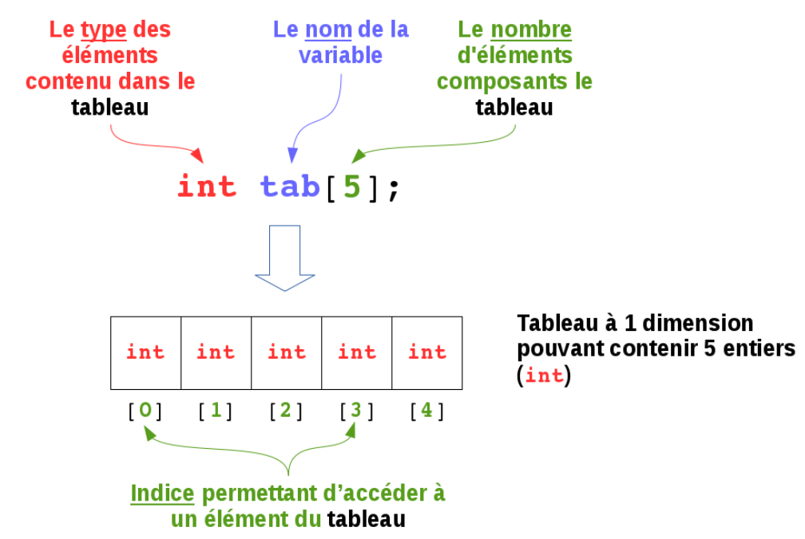
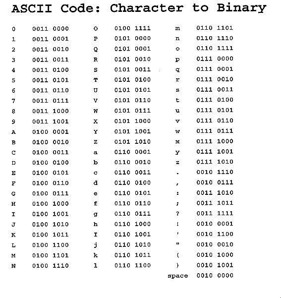

<!-- PARTIE 0 : Présentation du cours -->

<!-- _paginate: skip -->
<!-- _class: cover -->

<div class="coverBlockCenter">
<div class="coverModuleName">Programmation C / C++</div>
<div class="coverCourseName"><span class="important">#3 </span>Basiques (2)</div>
<div class="coverAuthor">par <span class="important">David Albert</span></div>
</div>


<div class="coverYear coverFooterRight">2023</div>

<!-- TABLE DES MATIERES -->

---

## Table des matières

<b><span class="important">01 </span> Les pointeurs</b>
Définition. Manipulation.

<b><span class="important">02 </span> Les tableaux</b>
Initialisation. Modification.

<b><span class="important">03 </span> Les chaînes de caractères</b>
Initialisation. Modification. char. string.

<b><span class="important">04 </span> Les fonctions</b>
Déclaration. Paramètres.

<b><span class="important">05 </span> Les types composés</b>
struct. union.

---

<!-- PARTIE 01 : Pointeurs -->

<div class='main'>

# 01

## Pointeurs

</div>

---

## Pointeurs

<div class='flex-horizontal'><div class='flex'>

<b class=''>Définition</b>
Un pointeur est une variable dont la valeur est une adresse mémoire.

<b class=''>Déclaration</b>
La déclaration d’une variable de type pointeur se fait comme suit :

```cpp
Type *nomVar;
```

<div class='block note'>

<i class='block-icon fas fa-info'></i>

On peut définir des pointeurs sur n’importe quel type.

- types de base : int, char, float, …
- types composés : tableaux, structures, …
- fonctions

</div>

</div><div class='flex'>

<b class=''>Opérateurs</b>

- l'opérateur d'indirection **\*p** qui retourne le contenu (valeur de la variable pointée)
- l'opérateur d’adressage **&p** qui donne l'adresse d'une variable

<b class=''>Exemple</b>

```cpp
/* définit un pointeur sur un entier */
int *ptr;
int i=10;

/* initialisation du pointeur */
ptr=&i;

/* accès au contenu par l’opérateur
d’indirection (équivaut à i=i+1) */
(*ptr)++;
```

</div></div>

---

## Pointeurs

### **Exercice**

Que donne le programme suivant ?

```cpp
#include <iostream>

using namespace std;

int main()
{
    int p1 = 10;
    int *p2 = &p1;

    cout << p1 << std::endl;

    *p2 += 10;
    cout << p1 << std::endl;
}
```

---

<!-- PARTIE 02 : Tableaux et containers -->

<div class='main'>

# 02

## Les tableaux

</div>

---

## Tableaux

**Definition :**
Un <b class='important'>tableau</b> est **un ensemble d'éléments de même type** désignés par un identificateur unique. Chaque élément est repéré par une valeur entière appelée **indice** (ou index) indiquant sa position dans l'ensemble.

<div class='flex-horizontal'><div class='flex'>



</div><div class='flex'>

<div class='block warning'>

<i class='block-icon fas fa-exclamation'></i>

L'indiçage démarre toujours à partir de 0.

</div>

</div></div>

---

## Tableaux

**Déclaration de tableaux**
La forme habituelle de déclaration d'un tableau est la suivante :
`type identificateur[dimension1]... [dimensionn]`

**_Exemples_**

```cpp
int notes[1000]; // un tableau de 1000 int non initialisé

float notes[1000]; // un tableau de 1000 float non initialisé

int notes[1000] = {0}; // un tableau de 1000 int initialisé à 0

float f[1000] = {0.}; // un tableau de 1000 float initialisé à 0

int coefficients[4] = { '1', '2', '2', '4' }; // un tableau de 4 entiers

// La dimension d'un tableau peut être omise si le compilateur peut en définir la valeur
float t[] = {2., 7.5, 4.1}; // tableau de 3 éléments

```

---

## Tableaux à plusieurs dimensions

**Déclaration de tableaux à plusieurs dimensions**

```cpp
// tableau à 2 dimensions de 2 lignes et 5 colonnes :
int m[2][5] = { 2, 6, -4, 8, 11, 3, -1, 0, 9, 2 }; // initialise avec des valeurs


// tableau à 2 dimensions pour stocker plusieurs chaînes de caractères
char noms[][16] = { {"robert"}, {"roger"}, {"raymond"}, {"alphonse"} };

int x[5][12][7]; // tableau a 3 dimensions, rarement au-delà de cette dimension
```

<div class='block warning'>

<i class='block-icon fas fa-exclamation'></i>

## Segmentation fault

Le plus grand danger dans la manipulation des tableaux est d'accéder en écriture en dehors du tableau. Cela provoque un accès mémoire interdit qui provoquera une exception de violation mémoire (**segmentation fault**).

</div>

---

## Tableaux et pointeurs

**⚠️ Note Importante**
L'identificateur du tableau ne désigne pas le tableau dans son ensemble, mais l'adresse en mémoire du début du tableau (l'adresse de la première case).

<div class='flex-horizontal'><div class='flex' style="flex:1.3">

**Conséquence 1**

Soit un tableau `tab` :

```cpp
int tab[] = {1, 2, 3};
```

Modification de la **première** valeur du tableau :

<div class='flex-horizontal'><div class='flex'>

```cpp
tab[0] = 5;
```

</div><div class='flex'>

$$\Longleftrightarrow$$

</div><div class='flex'>

```cpp
*tab = 5;
```

</div></div>

Modification de la **deuxième** valeur du tableau :

<div class='flex-horizontal'><div class='flex'>

```cpp
tab[1] = 3;
```

</div><div class='flex'>

$$\Longleftrightarrow$$

</div><div class='flex'>

```cpp
*(tab + 1) = 3;
```

</div></div>

Modification de la **troisième** valeur du tableau :

<div class='flex-horizontal'><div class='flex'>

```cpp
tab[2] = 1;
```

</div><div class='flex'>

$$\Longleftrightarrow$$

</div><div class='flex'>

```cpp
*(tab + 2) = 1;
```

</div></div>
</div><div class='flex'>

**Conséquence 2**

<div class='block note'>

<i class='block-icon fas fa-info'></i>

Lorsque l'on passe un tableau en paramètre d'une fonction, il n'est pas possible de connaître sa taille et il faudra donc lui passer aussi sa taille.

</div>

</div></div>

---

## Tableaux et pointeurs

### **Exercice**

Que donne le programme suivant ?

```cpp
#include <iostream>

using namespace std;

int main()
{
    int tab[3] = {1, 2, 3};
    int *p3 = tab;

    cout << tab[0] << tab[1] << tab[2] << std::endl;
    cout << *p3 << std::endl;

    *(p3 + 1) = 10;
    cout << tab[0] << tab[1] << tab[2] << std::endl;
    cout << tab[1] << std::endl;
    cout << *(p3 + 2) << std::endl;

    return 0;
}
```

---

<!-- PARTIE 03 : Chaînes de caractères -->

<div class='main'>

# 03

## Chaînes de caractères

</div>

---

## Les caractères

<div class='flex-horizontal'><div class='flex'>

**Type** `char`

**Exemples valeurs**
`'A'`, `'C'`, `'\n'`, `';'`, `'!'`, `'0'`, `'1'`, ...

**Déclaration**

```cpp
char a = 'A';
char newLine = '\n';
```

**Représentation en machine**

- [**Code ASCII**](https://fr.wikipedia.org/wiki/American_Standard_Code_for_Information_Interchange)
- [**unicode**](https://fr.wikipedia.org/wiki/Unicode)

</div><div class='flex'>

**Table ASCII**



</div></div>

---

## Les chaînes de caractères

**Définition :** Un tableau de caractères.

**Exemples :**
`"Brice"`, `"la vie est belle !"`, `"#0$£ù%&-"`, `""`, `"\n\t\t\t\n"`

<br/>

<div class='flex-horizontal'><div class='flex'>

**En C**
Il n'existe pas de type spécifique pour traiter les chaînes de caractères.

**Déclaration**

```cpp
char chaine[100];
char salut[10] = {'b', 'o', 'n', 'j', 'o', 'u', 'r', '\0' };
char salut[10] = "bonjour";
```

</div><div class='flex'>

**En C++**
Il existe le type **string** pour manipuler des chaînes de caractères.

**Type** `string`

**Déclaration**

```cpp
string prenom = "Robert";
string nom("Guillon");
```

</div></div>

---

<!-- PARTIE 05 : Packages  -->

<div class='main'>

# 04

## Fonctions

</div>

---

## Les fonctions

**Définition**
Une fonction est une suite d'instructions qui peuvent être réutilisées à différents endroits dans notre programme.

**Déclaration**
Une fonction se caractérise par :

- un **nom**
- une **liste de paramètre(s)** et leurs types
- un **type de retour**

<div class='flex-horizontal'><div class='flex'>

**Exemple**

```cpp
// Le prototype de la fonction calculeNombreDeSecondes :
int calculeNombreDeSecondes(int heures, int minutes, int secondes);

// Soit :
// - son nom : calculeNombreDeSecondes
// - sa liste de paramètre(s) : elle reçoit 3 int
// - son type de retour : int
```

</div><div class='flex'>

<div class='block note'>

<i class='block-icon fas fa-info'></i>

Si une fonction ne retourne aucune valeur. Alors le type de retour est **void**

```cpp
void showMessage(string msg);
```

$\Rightarrow$ Ce type de fonction est appelée **procédure**

</div>
</div></div>

---

## Les fonctions

En C/C++, il faut distinguer :

- la **déclaration** qui est une instruction fournissant au compilateur un certain nombre d’informations concernant une fonction

  ```cpp
  int plus(int, int); // fichier en-tête (.h)
  ```

- la **définition** qui revient à écrire le corps de la fonction
  ```cpp
  int plus(int a, int b) { return a + b; } // fichier source (.c ou .cpp)
  ```
- l'**appel** qui est son utilisation
  ```cpp
  int res = plus(2, 2); // fichier source (.c ou .cpp)
  ```

<div class='block warning'>

<i class='block-icon fas fa-exclamation'></i>

Pour être utilisée, une fonction doit être définit avant son utilisation. Sinon, le compilateur génèrera une erreur : **_’...’ was not declared in this scope._**

</div>

---

## Exemple

<div class='flex-horizontal'><div class='flex'>

Dans le fichier **_temps.h_**

```cpp
#ifndef __TEMPS_H__ // si l’étiquette __TEMPS_H__ n’est pas défini
#define __TEMPS_H__  // alors on définit l’étiquette __TEMPS_H__

int calculNbrSecondes(int heures, int minutes, int secondes);

#endif /* finsi __TEMPS_H__ */
```

<div class='block note'>

<i class='block-icon fas fa-info'></i>

La définition d'une macro `__TEMPS_H__` est très importante. Elle évite les déclarations multiples de la fonction `calculNbrSecondes`.

</div>

Dans le fichier **_temps.c_**

```cpp
#include "temps.h"

// La définition de la fonction calculeNombreDeSecondes :
int calculNbrSecondes(int heures, int minutes, int secondes)
{
    return ((heures*3600) + (minutes*60) + secondes);
}
```

</div><div class='flex'>

Dans le fichier **_main.c_**

```cpp
#include "temps.h"

int main(){
    // Vous pouvez maintenant utiliser (appeler)
    // la fonction calculNbrSecondes :
    int s = calculNbrSecondes(1, 0, 0);
    return 0;
}
```

</div></div>

---

<!-- PARTIE 06 : Types composés -->

<div class='main'>

# 05

## Types composés

</div>

---

## Types composés

Les **types composés** permettent de regrouper des variables au sein d'une même entité.

- variables de même types : <b class='important'>tableaux</b>
- variables de types différents : <b class='important'>structures de données</b>

**En C**, il existe 3 types de structures de données :

- les structures (**struct**)
- les unions (**union**)
- les champs de bits

**En C++**, la notion de type **classe** est ajoutée. Elle permet de réaliser des programmes orientés objet (POO).

---

## Structures

Une **structure** permet de grouper un certain nombre de variables de types différents au sein d'une même entité.

**_Exemple :_**

<div class='flex-horizontal'><div class='flex'>

```c
typedef struct
{
    int id;
    int age;
    float salary;
} Personne;
```

</div><div class='flex'>

<div class='block note'>

<i class='block-icon fas fa-info'></i>

En C++, le **typedef** est inutile.

</div>

</div></div>

**Accès aux membres**
Pour accéder aux membres d’une structure, on utilise :

<div class='flex-horizontal'><div class='flex'>

- l’opérateur d’accès **.** (point)
  pour une variable de type structuré

  ```cpp
  Personne jean = {9467, 37, 1140.6};

  float salary = jean.salary;
  ```

</div><div class='flex'>

- l’opérateur d’accès **->** (flèche)
  pour un pointeur sur un type structuré

  ```cpp
  Personne jean = {9467, 37, 1140.6};
  Personne *p_jean = &jean;

  float salary = jean->salary;
  ```

</div></div>

---

## Union

Une **union** est conceptuellement identique à une structure mais peut, à tout moment, contenir
n'importe lequel des différents champs.

<div class='block note'>

<i class='block-icon fas fa-info'></i>

Une union définit en fait plusieurs manières de regarder le même emplacement mémoire.

</div>

**_Exemple :_**

```cpp
typedef union mesureCapteur
{
    int iVal;
    float fVal;
    char cVal;
} Capteur;

int main()
{
    Capteur vitesseVent, temperatureMoteur;
    pressionAtmospherique.iVal = 1013; /* un int */
    temperatureMoteur.fVal = 50.5; /* un float */
    return 0;
}
```

---

## Références

http://tvaira.free.fr/bts-sn/poo-c++/cours-poo-c++/cours-c-c++.pdf
