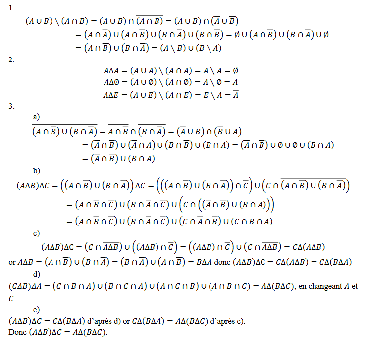

   
## Exercices (Théorie des ensembles)

https://f2school.com/theorie-des-ensembles/

 

### I) Définition d'ensembles

**Exercice I.1:**
Définir l'ensemble des entiers naturels strictements inférieurs à $5$.

**Solution :** $A = \left\{ x \in \mathbb{N} \mid x < 5 \right\}$

**Exercice I.2:**
Définir l'ensemble des entiers relatifs divisibles par $3$ de deux façons différentes.

**Solution :**
$A = \left\{ x \in \mathbb{Z} \mid \frac{x}{3} - \lfloor \frac{x}{3} \rfloor \neq 0 \right\}$
ou
$A = \left\{ x \in \mathbb{Z} \mid x = 3k,\ k \in \mathbb{Z} \right\}$
ou
$A = \left\{ 3k \mid k \in \mathbb{Z} \right\}$

**Exercice I.3:**
Définir l'ensemble des nombres impaires strictements supérieurs à $3$.

$A = \left\{ x \in \mathbb{Z} \mid x=2k + 1, k \in \mathbb{Z}\ et\ k>0 \right\}$

**Exercice I.4:**
Définir l'ensemble des points du cercle $\mathcal{C}$ de centre $(a,b) \in \mathbb{R}^2$ et de rayon $r$.

$\mathcal{C} = \left\{ (x, y) \in \mathbb{R}^2 \mid (x-a)^2 + (y-b)^2  = r^2 \right\}$

**Exercice I.5:**
Définir l'ensemble des points de tous les cercles dont l'aire est égale à $1$.

$\mathcal{C} = \left\{ (x, y) \in \mathbb{R}^2 \mid \forall a,b \in \mathbb{R},\ (x-a)^2 + (y-b)^2  = r^2\ et\ \pi r^2 = 1 \right\} = \mathbb{R^2}$

$\mathcal{C} = \left\{ (x, y) \in \mathbb{R}^2 \mid \forall a,b \in \mathbb{R},\ (x-a)^2 + (y-a)^2  = \frac{1}{\pi}\ \right\}$

**Exercice I.6:**
Définir l'ensemble des points du disque ouvert $\mathcal{D}$ de centre $(a,b) \in \mathbb{R}^2$ et de rayon $2$.

$\mathcal{D} = \left\{ (x, y) \in \mathbb{R}^2 \mid (x-a)^2 + (y-b)^2  < 4 \right\}$

### II) Relations ensemblistes

https://f2school.com/wp-content/uploads/2019/10/th%C3%A9orie-des-ensembles-exercice-02.pdf

**Exercice II.1 :**
Soient $A = \left\{1,2,3\right\}$ et $𝐵 = \left\{0,1,2,3\right\}$. Décrire les ensembles $𝐴 \cap 𝐵$, $𝐴 ∪ 𝐵$ et $𝐴 × 𝐵$.

$A \cap B = \{1,2,3\}$, $A \cup B = \{0, 1,2,3\}$, $A \times B = \{(1,0),(1,1),(1,2),...,(3,3)\}$

**Exercice II.2 :**
Soient $A=\{0,2,4\}$ et $B = \{1,3,4,5 \}$ dans le référentiel $E=\{0,1,2,3,4,5\}$.
Déterminer les ensembles $\overline{A}$,$\overline{B}$,$A \cap B$, $A \cup B$, $A \setminus B$, $\mathcal{P}(A)$ et $A \times B$

**Exercice II.3 :**
Soient $A = [1, 3]$ et $B=[2,4]$. Déterminer les ensembles $A \cap B$ et $A\cup B$.

$A \cap B = [2,3]$ et $A \cup B = [1, 4]$

**Exercice II.4 :**
Déterminer le complémentaire dans $\mathbb{R}$ des ensembles suivants : $A_1 = ] −\infty, 0]$, $A_2 = ] −\infty, 0[$, $A_3 = ]0, +\infty[$, $A_4 = [0, +\infty[$, $A_5 =]1,2[$, $A_6 = [1,2[$ 2.

$\bar{A_1} = ]0,+\infty[$ et $A \cup B = [1, 4]$

**Exercice II.5** Soient $A = ] − \infty, 1[ \cup ]2, +\infty[$, $B =] − \infty, 1[$ et $B = [2, +\infty[$. Comparer les ensembles $\bar{A}$ et $\bar{B} \cap \bar{C}$

**Exercice II.6**
Soient $𝐴 =] −\infty, 3]$, $𝐵 =] − 2,7]$ et $𝐶 =] − 5, +\infty[$ trois parties de $\mathbb{R}$.
Déterminer $𝐴 ∩ 𝐵$, $𝐴 ∪ 𝐵$, $𝐵 ∩ 𝐶$, $𝐵 ∪ 𝐶$, $ℝ ∖ 𝐴$, $𝐴 ∖ 𝐵$, $(ℝ ∖ 𝐴) ∩ (ℝ ∖ 𝐵)$, $(ℝ ∖ (𝐴 ∪ 𝐵)$, $(𝐴 ∩ 𝐵) ∪
(𝐴 ∩ 𝐶)$ et $𝐴 ∩ (𝐵 ∪ 𝐶)$

**Solution**
$(ℝ ∖ 𝐴) ∩ (ℝ ∖ 𝐵) = ℝ ∖ (𝐴 ∪ 𝐵) =]7, +∞[$
$(𝐴 ∩ 𝐵) ∪ (𝐴 ∩ 𝐶) =] − 2,3] ∪] − 5,3] =] − 5,3]$

**Exercice II.7 :**
Soit $A = \left\{1,8,10\right\}$. Décrire $\mathcal{P}(A)$, l'ensemble des parties de $A$.

**Exercice II.8 :**
Soit $C_{red} = [\![ 0; 2 ]\!],C_{green} = [\![ 0; 2 ]\!], C_{blue} = [\![ 0; 2 ]\!],$. Décrire $C_{red} \times C_{green} \times C_{blue}$.

---

**Exercice II.9 (démo de cours)**
Soient $A$, $B$ et $C$ trois parties d’un ensemble $E$. Montrer que :

1. $𝐴 ∪ (𝐵 ∩ 𝐶) = (𝐴 ∪ 𝐵) ∩ (𝐴 ∪ 𝐶)$
2. $𝐴 ∩ (𝐵 ∪ 𝐶) = (𝐴 ∩ 𝐵) ∪ (𝐴 ∩ 𝐶)$

**Solution**
Il s’agit de résultats du cours que l’on peut utiliser sans démonstration mais cet exercice demande de les
redémontrer.

1. Si 𝑥 ∈ 𝐴 ∪ (𝐵 ∩ 𝐶)
   Alors (𝑥 ∈ 𝐴 ou 𝑥 ∈ (𝐵 ∩ 𝐶))
   Alors (𝑥 ∈ 𝐴 ou (𝑥 ∈ 𝐵 et 𝑥 ∈ 𝐶))
   Si 𝑥 ∈ 𝐴 alors 𝑥 ∈ 𝐴 ∪ 𝐵 et 𝑥 ∈ 𝐴 ∪ 𝐶, par conséquent 𝑥 ∈ (𝐴 ∪ 𝐵) ∩ (𝐴 ∪ 𝐶).
   Si (𝑥 ∈ 𝐵 et 𝑥 ∈ 𝐶) alors (𝑥 ∈ 𝐴 ∪ 𝐵 et 𝑥 ∈ 𝐴 ∪ 𝐶)
   Donc si (𝑥 ∈ 𝐴 ou (𝑥 ∈ 𝐵 et 𝑥 ∈ 𝐶)) alors (𝑥 ∈ 𝐴 ∪ 𝐵 et 𝑥 ∈ 𝐴 ∪ 𝐶)
   On a montré que 𝐴 ∪ (𝐵 ∩ 𝐶) ⊂ (𝐴 ∪ 𝐵) ∩ (𝐴 ∪ 𝐶)
   Si 𝑥 ∈ (𝐴 ∪ 𝐵) ∩ (𝐴 ∪ 𝐶) alors (𝑥 ∈ 𝐴 ∪ 𝐵 et 𝑥 ∈ 𝐴 ∪ 𝐶).
   (𝑥 ∈ 𝐴 ∪ 𝐵 et 𝑥 ∈ 𝐴 ∪ 𝐶) ⇔ ((𝑥 ∈ 𝐴 ou 𝑥 ∈ 𝐵) et (𝑥 ∈ 𝐴 ou 𝑥 ∈ 𝐶))
   Si (𝑥 ∈ 𝐴 et (𝑥 ∈ 𝐴 ou 𝑥 ∈ 𝐶)) alors 𝑥 ∈ 𝐴 ∩ 𝐴 ou 𝑥 ∈ 𝐴 ∩ 𝐶
   Si (𝑥 ∈ 𝐵 et (𝑥 ∈ 𝐴 ou 𝑥 ∈ 𝐶)) alors 𝑥 ∈ 𝐵 ∩ 𝐴 ou 𝑥 ∈ 𝐵 ∩ 𝐶
   Alors 𝑥 ∈ 𝐴 ou 𝑥 ∈ 𝐴 ∩ 𝐶 ou 𝑥 ∈ 𝐵 ∩ 𝐴 ou 𝑥 ∈ 𝐵 ∩ 𝐶
   Alors 𝑥 ∈ 𝐴 ou 𝑥 ∈ 𝐴 ∩ 𝐶 ⊂ 𝐴 ou 𝑥 ∈ 𝐵 ∩ 𝐴 ⊂ 𝐴 ou 𝑥 ∈ 𝐵 ∩ 𝐶
   Alors 𝑥 ∈ 𝐴 ou 𝑥 ∈ 𝐵 ∩ 𝐶
   Alors 𝑥 ∈ 𝐴 ∪ (𝐵 ∩ 𝐶)
   On a montré que (𝐴 ∪ 𝐵) ∩ (𝐴 ∪ 𝐶) ⊂ 𝐴 ∪ (𝐵 ∩ 𝐶)
   Finalement 𝐴 ∪ (𝐵 ∩ 𝐶) = (𝐴 ∪ 𝐵) ∩ (𝐴 ∪ 𝐶)

2. Si 𝑥 ∈ 𝐴 ∩ (𝐵 ∪ 𝐶)
   Alors (𝑥 ∈ 𝐴 et 𝑥 ∈ 𝐵 ∪ 𝐶)
   Alors (𝑥 ∈ 𝐴 et (𝑥 ∈ 𝐵 ou 𝑥 ∈ 𝐶))
   Alors (𝑥 ∈ 𝐴 et 𝑥 ∈ 𝐵) ou (𝑥 ∈ 𝐴 et 𝑥 ∈ 𝐶)
   Alors 𝑥 ∈ 𝐴 ∩ 𝐵 ou 𝑥 ∈ 𝐴 ∩ 𝐶
   Alors 𝑥 ∈ (𝐴 ∩ 𝐵) ∪ (𝐴 ∩ 𝐶)
   On a montré que 𝐴 ∩ (𝐵 ∪ 𝐶) ⊂ (𝐴 ∩ 𝐵) ∪ (𝐴 ∩ 𝐶)
   Si 𝑥 ∈ (𝐴 ∩ 𝐵) ∪ (𝐴 ∩ 𝐶)
   Alors 𝑥 ∈ 𝐴 ∩ 𝐵 ou 𝑥 ∈ 𝐴 ∩ 𝐶
   Alors (𝑥 ∈ 𝐴 et 𝑥 ∈ 𝐵) ou (𝑥 ∈ 𝐴 et 𝑥 ∈ 𝐶)
   Alors (𝑥 ∈ 𝐴 ou 𝑥 ∈ 𝐴) et (𝑥 ∈ 𝐴 ou 𝑥 ∈ 𝐶) et (𝑥 ∈ 𝐵 ou 𝑥 ∈ 𝐴) et (𝑥 ∈ 𝐵 ou 𝑥 ∈ 𝐶)

Alors 𝑥 ∈ 𝐴 et 𝑥 ∈ 𝐴 ∪ 𝐶 et 𝑥 ∈ 𝐵 ∪ 𝐴 et 𝑥 ∈ 𝐵 ∪ 𝐶
Comme 𝑥 ∈ 𝐴 et 𝑥 ∈ 𝐴 ∪ 𝐶 et 𝑥 ∈ 𝐵 ∪ 𝐴 entraine que 𝑥 ∈ 𝐴

𝑥 ∈ (𝐴 ∩ 𝐵) ∪ (𝐴 ∩ 𝐶) ⇒ 𝑥 ∈ 𝐴 et 𝑥 ∈ 𝐵 ∪ 𝐶 ⇒ 𝑥 ∈ 𝐴 ∩ (𝐵 ∪ 𝐶)
On a montré que (𝐴 ∩ 𝐵) ∪ (𝐴 ∩ 𝐶) ⊂ 𝐴 ∩ (𝐵 ∪ 𝐶)
Et finalement 𝐴 ∩ (𝐵 ∪ 𝐶) = (𝐴 ∩ 𝐵) ∪ (𝐴 ∩ 𝐶)

**Exercice II.10**

1. Montrer que $(𝐴 ∖ 𝐵) ∖ 𝐶 = 𝐴 ∖ (𝐵 ∪ 𝐶)$
2. Montrer que $(𝐴 ∖ 𝐵) ∩ (𝐶 ∖ 𝐷) = (𝐴 ∩ 𝐶) ∖ (𝐵 ∪ 𝐷)$

**Solution**

1. $(𝐴 ∖ 𝐵) ∖ 𝐶 = (𝐴 ∩ \overline{𝐵}) ∖ 𝐶 = (𝐴 ∩ \overline{𝐵}) ∩ \overline{C} = 𝐴 ∩ (\overline{𝐵} ∩ \overline{C}) = 𝐴 ∩ (\overline{𝐵 ∪ 𝐶}) = 𝐴 ∖ (𝐵 ∪ 𝐶)$
2. $(𝐴 ∖ 𝐵) ∩ (𝐶 ∖ 𝐷) = (𝐴 ∩ \overline{𝐵}) ∩ (𝐶 ∩ \overline{D}) = (𝐴 ∩ 𝐶) ∩ (\overline{𝐵} ∩ \overline{D}) = (𝐴 ∩ 𝐶) ∩ (\overline{𝐵 ∪ 𝐷}) = (𝐴 ∩ 𝐶) ∖ (𝐵 ∪ 𝐷)$

**Exercice II.11**
On donne la définition suivante $𝐴Δ𝐵 = (𝐴 ∖ 𝐵) ∪ (𝐵 ∖ 𝐴)$

1. Montrer que
   $(𝐴 ∩ 𝐵) ∩ (\overline{𝐴 ∩ 𝐶}) = 𝐴 ∩ 𝐵 ∩ \overline{𝐶}$
   $(𝐴 ∩ 𝐶) ∩ (\overline{𝐴 ∩ 𝐵}) = 𝐴 ∩ 𝐶 ∩ \overline{𝐵}$
2. En déduire que
   $(𝐴 ∩ 𝐵)Δ(𝐴 ∩ 𝐶) = 𝐴 ∩ (𝐵Δ𝐶)$

**Solution**

1. $(𝐴 ∩ 𝐵) ∩ (\overline{𝐴 ∩ 𝐶}) = (𝐴 ∩ 𝐵) ∩ (\overline{𝐴} ∪ \overline{𝐶}) = (𝐴 ∩ 𝐵 ∩ \overline{𝐴}) ∪ (𝐴 ∩ 𝐵 ∩ \overline{𝐶}) = ∅ ∪ (𝐴 ∩ 𝐵 ∩ \overline{𝐶})
= 𝐴 ∩ 𝐵 ∩ \overline{𝐶}$
   Pour la seconde il suffit d’intervertir 𝐵 et 𝐶

2. $(𝐴 ∩ 𝐵)Δ(𝐴 ∩ 𝐶) = ((𝐴 ∩ 𝐵) ∖ (𝐴 ∩ 𝐶)) ∪ ((𝐴 ∩ 𝐶) ∖ (𝐴 ∩ 𝐵))$

   $= ((𝐴 ∩ 𝐵) ∩ (𝐴 ∩ 𝐶)) ∪ ((𝐴 ∩ 𝐶) ∩ (𝐴 ∩ 𝐵)) = (𝐴 ∩ 𝐵 ∩ 𝐶) ∪ (𝐴 ∩ 𝐶 ∩ 𝐵)$

   $= 𝐴 ∩ ((𝐵 ∩ 𝐶) ∪ (𝐶 ∩ 𝐵)) = 𝐴 ∩ ((𝐵 ∖ 𝐶) ∪ (𝐶 ∖ 𝐵)) = 𝐴 ∩ (𝐵Δ𝐶)$

---

### III) Pour aller plus loin

**Exercice III.1**
Soit $E$ un ensemble et soit $\mathcal{P}(E)$ l’ensemble des parties de $E$.
Pour $A$ et $B$ dans $\mathcal{P}(E)$, on appelle différence symétrique de $A$ par $B$ l’ensemble, noté $𝐴Δ𝐵$ défini par : $𝐴Δ𝐵 = (𝐴 ∪ 𝐵) ∖ (𝐴 ∩ 𝐵)$

1. Montrer que $𝐴Δ𝐵 = (𝐴 ∩ \overline{𝐵}) ∪ (𝐵 ∩ \overline{A}) = (𝐴 ∖ 𝐵) ∪ (𝐵 ∖ 𝐴)$.
2. Calculer $𝐴Δ𝐴$, $𝐴Δ∅$ et $𝐴Δ𝐸$.
3. Montrer que pour tous $A$, $B$ et $C$ dans $\mathcal{P}(E)$, on a :
   a) Montrer que : $\overline{\left(𝐴 \cap \overline{𝐵}\right) \cup \left(𝐵 \cap \overline{𝐴}\right)} = \left(\overline{𝐴} \cap \overline{𝐵}\right) \cup \left(𝐵 \cap 𝐴\right)$
   b) Montrer que : $(𝐴Δ𝐵)Δ𝐶 = (𝐴 ∩ \overline{𝐵} ∩ \overline{𝐶}) ∪ (𝐵 ∩ \overline{𝐴} ∩ \overline{𝐶}) ∪ (𝐶 ∩ \overline{𝐴} ∩ \overline{𝐵}) ∪ (𝐶 ∩ 𝐵 ∩ 𝐴)$
   c) Montrer que $𝐴Δ(𝐵Δ𝐶) = (𝐶𝛥𝐵)𝛥𝐴$
   d) A l’aide du b), montrer que $(𝐴𝛥𝐵)𝛥𝐶 = (𝐶𝛥𝐵)𝛥𝐴$
   e) En déduire que : $(𝐴Δ𝐵)Δ𝐶 = 𝐴Δ(𝐵Δ𝐶)$

---

**Exercice III.2 (démo de cours)**
Soit $E$ un ensemble et $F$ et $G$ deux parties de $E$. Démontrer que :

1. $(\overline{𝐴 \cap 𝐵}) = \overline{𝐴} \cup \overline{𝐵}$
1. $(\overline{𝐴 \cup 𝐵}) = \overline{𝐴} \cap \overline{𝐵}$
1. $E \setminus (A \cap B) = (E \setminus A) \cup (E \setminus B)$
1. $E \setminus (A \cup B) = (E \setminus A) \cap (E \setminus B)$

**Solution**

Il s’agit de résultats du cours, on peut les utiliser sans démonstration mais c’est l’objet de cet exercice.

1. Soit $𝑥 ∈ \overline{(𝐴 ∩ 𝐵)}$, $𝑥 ∉ 𝐴 ∩ 𝐵$ et donc $𝑥 ∉ 𝐴$ ou $𝑥 ∉ 𝐵$, ce qui signifie que $𝑥 ∈ \overline{𝐴} ∪ \overline{𝐵}$
   Cela montre que $\overline{(𝐴 ∩ 𝐵)} ⊂ \overline{𝐴} ∪ \overline{𝐵}$.
   Soit $𝑥 ∈ \overline{A} ∪ \overline{B}$, $𝑥 ∉ 𝐴$ ou $𝑥 ∉ 𝐵$ donc $𝑥 ∉ 𝐴 ∩ 𝐵$ ce qui entraine que $𝑥 ∈ \overline{(𝐴 ∩ 𝐵)}$.
   Cela montre que $\overline{A} ∪ \overline{B} ⊂ \overline{(𝐴 ∩ 𝐵)}$.
   Et finalement $\overline{(𝐴 ∩ 𝐵)} = \overline{A} ∪ \overline{B}$
   **Remarque :** On aurait raisonner par équivalence.
2. Soit $𝑥 ∈ \overline{(𝐴 ∪ 𝐵)}$, $𝑥 ∉ 𝐴 ∪ 𝐵$ et donc $𝑥 ∉ 𝐴$ et $𝑥 ∉ 𝐵$, ce qui signifie que $𝑥 ∈ \overline{A} ∩ \overline{B}$
   Cela montre que $\overline{(𝐴 ∪ 𝐵)} ⊂ \overline{A} ∩ \overline{B}$.
   Soit $𝑥 ∈ \overline{A} ∩ \overline{B}$, $𝑥 ∉ 𝐴$ et $𝑥 ∉ 𝐵$ donc $𝑥 ∉ 𝐴 ∪ 𝐵$ ce qui entraine que $𝑥 ∈ \overline{(𝐴 ∪ 𝐵)}$.
   Cela montre que $\overline{A} ∩ \overline{B} ⊂ \overline{(𝐴 ∪ 𝐵)}$.
   Et finalement $\overline{(𝐴 ∪ 𝐵)} = \overline{A} ∩ \overline{B}$
   **Remarque :** On aurait raisonner par équivalence.

**Exercice III.3**
Soit $E$ un ensemble et $F$ et $G$ deux parties de $E$. Démontrer que :

1. $𝐹 ⊂ 𝐺 ⇔ 𝐹 ∪ 𝐺 = 𝐺$
2. $𝐹 ⊂ 𝐺 ⇔ 𝐹 ∩ \overline{𝐺} = ∅$

**Solution**

Il s’agit de résultats du cours, on peut les utiliser sans démonstration mais c’est l’objet de cet exercice.

1. Supposons que 𝐹 ⊂ 𝐺.
   Si 𝑥 ∈ 𝐹 ∪ 𝐺 alors 𝑥 ∈ 𝐹 ⊂ 𝐺 ou 𝑥 ∈ 𝐺 alors 𝑥 ∈ 𝐺. Donc 𝐹 ∪ 𝐺 ⊂ 𝐺.
   Si 𝑥 ∈ 𝐺 alors 𝑥 ∈ 𝐹 ∪ 𝐺, par conséquent 𝐹 ∪ 𝐺 = 𝐺.
   On a montré que 𝐹 ⊂ 𝐺 ⇒ 𝐹 ∪ 𝐺 = 𝐺
   Supposons que 𝐹 ∪ 𝐺 = 𝐺.
   Soit 𝑥 ∈ 𝐹, 𝑥 ∈ 𝐹 ∪ 𝐺 = 𝐺 donc 𝑥 ∈ 𝐺.
   On a montré que 𝐹 ∪ 𝐺 = 𝐺 ⇒ 𝐹 ⊂ 𝐺.
   Finalement 𝐹 ⊂ 𝐺 ⇔ 𝐹 ∪ 𝐺 = 𝐺.
2. Supposons que 𝐹 ⊂ 𝐺.
   Si 𝑥 ∈ 𝐹 ∩ 𝐶𝐸 𝐺, 𝑥 ∈ 𝐹 et 𝑥 ∉ 𝐺 ⊃ 𝐹 donc 𝑥 ∈ 𝐹 et 𝑥 ∉ 𝐹 ce qui est impossible par conséquent
   𝐹 ∩ 𝐶𝐸𝐺 = ∅.
   On a montré que 𝐹 ⊂ 𝐺 ⇒ 𝐹 ∩ 𝐶𝐸 𝐺 = ∅
   Supposons que 𝐹 ∩ 𝐶𝐸 𝐺 = ∅.

