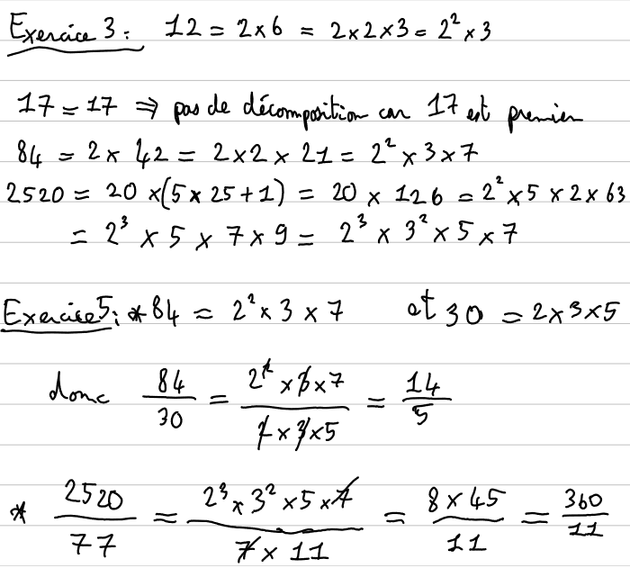
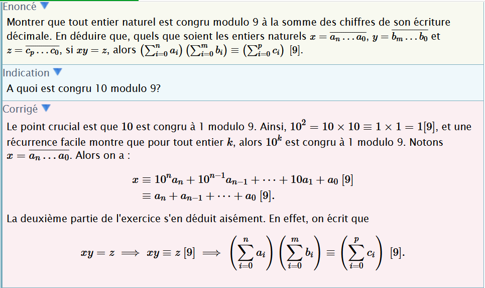
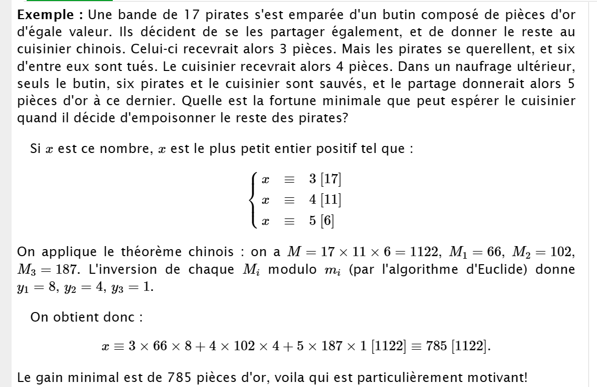

## Correction Exercices (Arithmetique modulaire)

### Partie I: Divisibilité

https://maths.ac-creteil.fr/IMG/pdf/3.nombrespremiers.cours-2.pdf

http://www.jaicompris.com/lycee/math/arithmetique/pgcd.php

https://www.bibmath.net/ressources/index.php?action=affiche&quoi=bde/arithm/congruence&type=fexo

**Exercice I.1**
Construire un nombre divisible par $2$,$3$,$4$,$5$,$9$ et $10$ en se basant uniquement sur les critère de divisibilité.

**Solution**

- 2 160 est divisible par 2, par 5, par 10. En effet, le chiffre des unités est 0.
- 2 160 est divisible par 4. En effet, 60 est divisible par 4.
- 2 160 est divisible par 3 et 9. En effet, $2 + 1 + 6 + 0 = 9$ et 9 est divisible par 3 et par 9

**Exercice I.2**
...
...

**Exercice I.3** Soient $x$ et $y$ des entiers. Montrer que $2x + 3y$ est divisible par $7$ si et seulement si $5x + 4y$ l'est.

**Solution :** Supposons que 7 divise 2x + 3y, alors il divise 6 (2x + 3y) − 7 (x + 2y) = 5x + 4y.
Réciproquement si 7 divise 5x + 4y, il divise 6 (5x + 4y) − 7 (4x + 3y) = 2x + 3y.

**Exercice I.4 :** Pour quels entiers $n$ strictement positifs, le nombre $n^2 + 1$ divise-t-il $n + 1$ ?

**Solution :** Si $n^2 + 1$ divise $n + 1$, comme tout est positif, on doit avoir $n^2 + 1  \le n + 1$, ce qui n'est vérifié que pour $n = 1$. On vérifie ensuite que n = 1 est bien solution.

 

### _<u>Partie II: PGCD et nombres premiers (~2h00)</u>_

**Exercice II.1**
Donner la définition d'un nombre premier puis donner la liste des 20 premiers nombres premiers.

**Solution**
Voir le cours.

**Exercice II.2**
Les nombres suivants sont-ils premiers ? Justifier. $0, 1, 2, 3, 4, 91, 123$

**Solution**

$0,1,2,3,4 \Rightarrow$ voir le cours

$91$ n'est pas premier car il est divisible par 7 et 13

$123$ n'est pas premier car il est divisible par 3 et 41

**Exercice II.3**
Décomposer en produit de facteurs premiers les nombres suivants : $12, 17, 84,2520$

**Exercice II.4**
Trouver la fraction irréductible égale à $\frac{84}{30}$ et $\frac{2520}{77}$.

**_Indice: on peut décomposer le numérateur et le dénominateur de la fraction en produit de facteurs premiers_**

---

**Exercice II.5**
Déterminer le PGCD de 4480 et 400 à l'aide de la décomposition en facteurs premiers.

**Exercice II.6**
Déterminer le PGCD de 3045 et 300 à l'aide de l'algorithme d'Euclide.

---

### Partie III : Congruences

http://www.jaicompris.com/lycee/math/arithmetique/congruence-Z.php

https://www.bibmath.net/ressources/index.php?action=affiche&quoi=bde/arithm/congruence&type=fexo

**Exercice XX.YY**

1. Montrer que tout entier naturel est congru modulo $9$ à la somme des chiffres de son écriture décimale.

2. En déduire que, quels que soient les entiers naturels $x= \overline{a_n...a_0}$, $y= \overline{b_m...b_0}$ et $z=\overline{c_p...c_0}$, si $xy=z$, alors $\left(\sum_{i=0}^{n}a_i\right)\left(\sum_{i=0}^{m}b_i\right) \equiv \left(\sum_{i=0}^{p}c_i\right) \left[9\right]$

---

**Exercice XX.YY**
Une bande de 17 pirates possède un trésor constitué de pièces d'or d'égale valeur. Ils projettent de se lPes partager également, et de donner le reste au cuisinier chinois. Celui-ci recevrait alors 3 pièces. Mais les pirates se querellent, et six d'entre eux sont tués. Un nouveau partage donnerait au cuisinier 4 pièces. Dans un naufrage ultérieur, seuls le trésor, six pirates et le cuisinier sont sauvés, et le partage donnerait alors 5 pièces d'or à ce dernier. Quelle est la fortune minimale que peut espérer le cuisinier s'il décide d'empoisonner le reste des pirates ?

