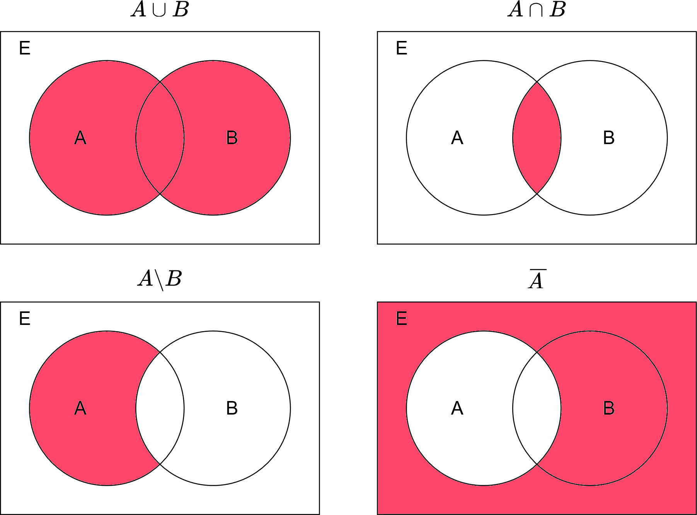

<!-- PAGE DE COUVERTURE -->
<!-- _paginate: skip -->
<!-- _class: cover -->

Mathématiques pour l'informatique

#1 Théorie des ensembles

par David Albert

2023

---

<!-- TABLE DES MATIERES -->

## Table des matières

<b>00 Notations</b>

<b>01 Ensemble et intervalles</b>
Ensembles. Intervalles de $\mathbb{R}$ et de $\mathbb{N}$.

<b>02 Relations ensemblistes</b>
Union. Intersection. Complémentaire. Produit.

<!-- FIN TABLE DES MATIERES -->

---

## **00** Notations

$\emptyset$ensemble vide

$\mathbb{N}$ensemble des entiers naturels (positifs ou nuls)

$\mathbb{N}^*$ensemble des entiers naturels strictement positifs

$\mathbb{Z}$ ensemble des entier relatifs

$\mathbb{Q}$ ensemble des nombres rationnels

$\mathbb{R}$ ensemble des nombres réels

$\in et \notin$ appartenance à un ensemble

$\subset\ et\ \not\subset$ inclusion d'un ensemble dans un sous-ensemble

$\cup$ union de deux ensembles

$\cap$ intersection de deux ensembles

$\bar{A}$ complémentaire de A

---

<!-- PARTIE 01 : Ensemble et relations -->

# 01

## Ensembles en intervalles

---

## Ensembles $\emptyset, \mathbb{N}, \mathbb{Z}, \mathbb{R}$

**Ensemble vide $\emptyset$**
Un ensemble qui ne contient aucun élément s'appelle l'ensemble vide et se note $\emptyset$

**Nombres entiers naturels $\mathbb{N}$**
Un nombre entier naturel est un nombre entier qui est positif.
L'ensemble des **nombres entiers naturels** est noté $\mathbb{N}$.
$\mathbb{N} = \left\{0,1,2,3,4,...\right\}$

**Nombres entiers relatifs $\mathbb{Z}$**
Un nombre entier relatif est un nombre entier qui est positif ou négatif.
L'ensemble des **nombres entiers relatifs** est noté $\mathbb{Z}$.
$\mathbb{Z} = \left\{..., −3,−2 ,−1, 0 ,1, 2 , 3,...\right\}$

**Nombres réels $\mathbb{R}$**
L'ensemble des **nombres réels** est noté $\mathbb{R}$.
C'est l'ensemble de tous les nombres qui peuvent être représentés par une partie entière et une liste finie ou infinie de décimales.

---

## Ensemble et intervalles

### **Définitions**

<i class='far fa-heart' style='padding-right:1rem;'></i>
<b>Définition - Ensemble</b>

Un **ensemble** est bien défini s'il est donné par une collection d'éléments qui satisfont une propriété caractéristique explicite, c'est-à-dire commune à tous les éléments de l'ensemble et à eux seuls.

Si une telle propriété est notée $P$, on notera $\left\{ x \mid P (x)\right\}$ l'ensemble correspondant, c'est à dire l'ensemble des x vérifiant la propriété $P$.

**Exemples :**

- $A = \left\{ x \in \mathbb{N} \mid x > 7 \right\}$ est l'ensemble des entiers strictement supérieur à $7$.

- $B = \left\{ x \in \mathbb{R} \mid -5 \le x \le 12 \right\}$ est l'ensemble des nombres réels compris entre $-5$ et $12$ inclus.

- $C = \left\{ (\theta_1, \theta_2) \in [0,1]^2 \mid \theta_1 + \theta_2 = 1 \right\}$ est l'ensemble des échantillons possibles de la loi de probabilité de Dirichlet $Dir(1,1)$.

---

## Référentiel

Nous supposerons toujours que les éléments constituant nos ensembles font partie d'un **référentiel** (qui peut être, par exemple, les étudiants inscrits à ce cours, les nombres entiers, les nombres réels, les villes de Belgique, ...) et que **la propriété sélectionne** certains éléments de ce référentiel (par exemple, les étudiants inscrits au cours qui mesurent moins d'1m70, les nombres pairs, les nombres réels qui sont irrationnels, les villes de Flandre, ...).

S'il n'y a pas d'ambiguïté sur le référentiel, on gardera la notation implicite $\left\{x \mid P (x)\right\}$. Si par contre, on souhaite distinguer deux référentiels, par exemple, ceux des entiers $\mathbb{Z}$ et des réels $\mathbb{R}$, on écrira $\left\{x \in \mathbb{Z} \mid x \leq 0\right\}$ et $\left\{x \in \mathbb{R} \mid x \leq 0\right\}$.

**Exemple**
Soit $A=\left\{0,1,2\right\}$, $B=\{-51, 23, -1, -6, 10\}$ et $\mathbb{N}$, trois référentiels distincts.

On a $\left\{x \in A \mid x < 0\right\} \ne \left\{x \in B \mid x < 0\right\} \ne \left\{x \in \mathbb{Z} \mid x < 0\right\}$

En effet,
$(i)\ \left\{x \in A \mid x < 0\right\} = \emptyset$
$(ii)\ \left\{x \in B \mid x < 0\right\} = \{-51, -1, -6\}$
$(iii)\ \left\{x \in \mathbb{Z} \mid x < 0\right\} = \{..., -4, -3, -2, -1\}$

---

## Ensembles et intervalles

<i class='far fa-heart' style='padding-right:1rem;'></i>
<b>Définition - Intervalle</b>

Un **intervalle de $\mathbb{R}$** est une partie $I$ de $\mathbb{R}$ vérifiant la propriété suivante:

$$\forall x,y \in I,\ \forall z \in \mathbb{R};\ si\ x \le z \le y\ alors\ z \in I$$

On démontre alors qu'un intervalle est forcément un ensemble du type suivant :

- L'ensemble vide $\emptyset$
- $\left\{ a \right\} = [a,a]$
- $\mathbb{R} = ]-\infty,+\infty[$
- $\{x \in \mathbb{R} \mid a \leq x \leq b \} = [a , b]$ <i class='important' style="font-size:0.85rem">(fermé borné)</i>
- $\{x \in \mathbb{R} \mid a < x < b \} = ]a, b[$ <i class='important' style="font-size:0.85rem">(ouvert borné)</i>
- $\{x \in \mathbb{R} \mid a < x \leq b \} = ]a, b]$ <i class='important' style="font-size:0.85rem">(borné, ouvert à gauche)</i>
- $\{x \in \mathbb{R} \mid a \leq x < b \} = [a, b[$ <i class='important' style="font-size:0.85rem">(borné, ouvert à droite)</i>

- $\left\{x \in \mathbb{R} \mid x < a\right\} = ]-\infty, a[$ <i class='important' style="font-size:0.85rem">(non borné, fermé à gauche)</i>
- $\left\{x \in \mathbb{R} \mid x \leq a\right\} = ]-\infty, a]$ <i class='important' style="font-size:0.85rem">(non borné, fermé à droite)</i>
- $\left\{x \in \mathbb{R} \mid x > a \right\} = ]a, +\infty[$ <i class='important' style="font-size:0.85rem">(non borné, ouvert à gauche)</i>
- $\left\{x \in \mathbb{R} \mid x \geq a\right\} = [a, +\infty[$ <i class='important' style="font-size:0.85rem">(non borné, ouvert à droite)</i>

Pour les intervalles de $\mathbb{N}$, on pourra utiliser la notation $[\![a,b]\!] = \{ n \in \mathbb{N} \mid a \le n \le b \}$.

---

<!-- PARTIE 02 : Relations ensemblistes -->

# 02

## Relations ensemblistes

---

## Relations ensemblistes

### **Définitions**

Soit $E$ notre référentiel (connu de tous), et soient $A$ et $B$ deux sous-ensembles de $E$.

<b class='important'>Appartenance $\in$ et $\notin$</b>
Si $x$ est un élément de $E$, on écrit $x \in A$ pour signifier que $x$ est un élément de $A$.
On note aussi $x \notin A$ pour signifier que $x$ n'est pas un élément de $A$.

<b class='important'>Inclusion $\subset$ et $\not\subset$</b>
On note l'inclusion de $A$ dans $B$ par $A \subset B$. Ceci signifie que tout élément de $A$ est aussi un élément de $B$. On dit que $A$ est un **sous-ensemble** (ou une **partie**) de $B$.
De plus, on note $A \not\subset B$ si $\exists x \in A$ tel que $x \notin B$.

<b class='important'>Egalité $=$</b>
L'égalité de deux ensembles est bien définie. On écrit $A = B$ lorsque $A \subset B$ et $B \subset\ A$. Autrement dit, $A$ et $B$ sont égaux lorsque tout élément de $A$ est aussi dans $B$ et, inversement, tout élément de $B$ appartient également à $A$.

---

## Relations ensemblistes

### **Définitions**

Soit $E$ notre référentiel (connu de tous), et soient $A$ et $B$ deux sous-ensembles de $E$.

<b class='important'>Union $\cup$</b>
L'union de $A$ et de $B$, notée $A \cup B$, est l'ensemble qui contient à la fois les éléments de $A$ et de $B$.
On a donc $A \cup B = \left\{x \in E \mid x \in A\ ou\ x \in B\right\}$

<b class='important'>Intersection $\cap$</b>
L'intersection de $A$ et de $B$, notée $A \cap B$, est l'ensemble qui contient les éléments qui appartiennent à la fois à A et à B. On a donc $A \cap B = \left\{x \in E \mid x ∈ A\ et\ x ∈ B\right\}$

<b class='important'>La différence $\setminus$ </b>
La différence de deux ensembles $A$ et $B$ (on dit aussi "A moins B"), notée $A \setminus B$, est l'ensemble qui contient les éléments de A n'appartenant pas à B. On a donc $A \setminus B = \left\{x \in E \mid x ∈ A\ et\ x \notin B\right\}$

<b class='important'>Le complémentaire $\bar{A}$ </b>
Le complémentaire de $A$ dans $E$, noté $\bar{A}$, est l'ensemble des éléments de $E$ qui ne sont pas dans $A$. On a donc $\bar{A} = E \setminus A = \left\{x \in E \mid x \notin A\right\}$. D'autres notations existent: $C_{E}(A)$, $A^{c}$ ou encore $A'$.

---

## Relations ensemblistes

### **Définitions**

Soit $E$ notre référentiel (connu de tous), et soient $A$ et $B$ deux sous-ensembles de $E$.

<b class='important'>L'ensemble des parties $\mathcal{P}(A)$</b>
L'ensemble des parties d'un ensemble $A$, noté $P(A)$, est l'ensemble de toutes les
parties de $A$ : $\mathcal{P}(A) = \left\{ B \mid B \subset A \right\}$. On remarquera que $A, B \in \mathcal{P}(E).$

<b class='important'>L'ensemble produit $A \times B$</b>
L'ensemble produit de $A$ et de $B$, noté $A \times B$, est définit comme suit : $A \times B = \left\{ (a, b) \mid a \in A, b \in B \right\}$

---

## Ensembles et relations

### **Exemple**

Soient $A=\{1,3,5\}$ et $B = \{0,1,2,3,4 \}$ dans le référentiel $E = [\![0,10 ]\!]$.

Donnez $A \cap B$, $A \cup B$, $A \setminus B$, $\overline{A}$ et $\mathcal{P}(A)$

---

## Ensembles et relations

### **Exemple**

Soient $A=\{1,3,5\}$ et $B = \{0,1,2,3,4 \}$ dans le référentiel $E = [\![0,10 ]\!]$.

Donnez $\overline{A}$, $A \cap B$, $A \cup B$, $A \setminus B$, $\overline{A}$ et $\mathcal{P}(A)$

$8 \notin A$ mais $1 \in A$
$\{1,2\} \not\subset A$ mais $\{1,3\} \subset A$

$A \cap B = \{1,3\}$
$A \cup B = \{1,2,3,4,5\}$
$A \setminus B = \{5\}$
$\overline{A} = \{0,2,4,6,7,8,9,10\}$

$\mathcal{P}(A)= \{\emptyset, \left\{1\}, \{3\},\{5\}, \{1,3\}, \{1,5\}, \{3, 5\}, \{1, 3, 5\}\right\}$

---

## Relations ensemblistes

### **Représentation visuelle**

---

## Relations ensemblistes

### **Propriétés**

Soit $X$ un ensemble et soient $A, B, C \in \mathcal{P}(X)$. Alors

1. $A \cap B = B \cap A$ <i class='important'>(commutativité)</i>
1. $A \cup B=B \cup A$ <i class='important'>(commutativité)</i>
1. $A \cap (B \cap C) = (A \cap B) \cap C = A \cap B \cap C$ <i class='important'>(associativité)</i>
1. $A \cup (B \cup C) = (A \cup B) \cup C = A\cup B \cup C$ <i class='important'>(associativité)</i>
1. $A \cap (B \cup C) = (A \cap B) \cup (A \cap C)$ <i class='important'>(distributivité)</i>
1. $A \cup (B \cap C) = (A \cup B) \cap (A \cup C)$ <i class='important'>(distributivité)</i>
1. $\overline{A \cap B} = \bar{A} \cup \bar{B}$
1. $\overline{A \cup B} = \bar{A} \cap \bar{B}$
1. $A \setminus B = A \cap \bar{B}$
1. Si $A \subset B$, alors $\mathcal{P}(A) \subset \mathcal{P}(B)$

<i class='info'>(certaines démonstrations seront réalisées en TD)</i>
