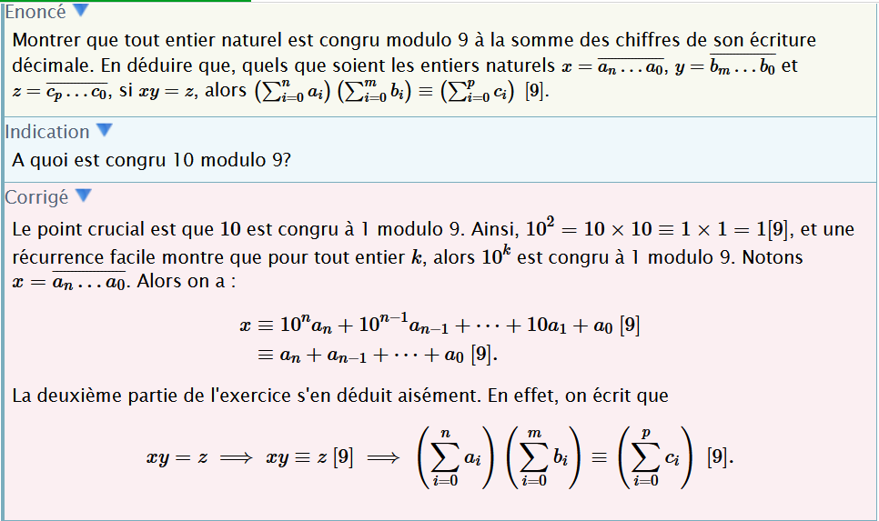
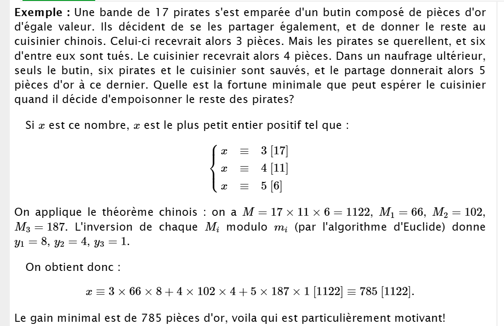

## Correction Exercices (Arithmetique modulaire)

### Partie I: Divisibilité

---

### Partie III : Congruences

**Exercice XX.YY**

1. Montrer que tout entier naturel est congru modulo $9$ à la somme des chiffres de son écriture décimale.

2. En déduire que, quels que soient les entiers naturels $x= \overline{a_n...a_0}$, $y= \overline{b_m...b_0}$ et $z=\overline{c_p...c_0}$, si $xy=z$, alors $\left(\sum_{i=0}^{n}a_i\right)\left(\sum_{i=0}^{m}b_i\right) \equiv \left(\sum_{i=0}^{p}c_i\right) \left[9\right]$

---

**Exercice XX.YY**
Une bande de 17 pirates possède un trésor constitué de pièces d'or d'égale valeur. Ils projettent de se les partager également, et de donner le reste au cuisinier chinois. Celui-ci recevrait alors 3 pièces. Mais les pirates se querellent, et six d'entre eux sont tués. Un nouveau partage donnerait au cuisinier 4 pièces. Dans un naufrage ultérieur, seuls le trésor, six pirates et le cuisinier sont sauvés, et le partage donnerait alors 5 pièces d'or à ce dernier. Quelle est la fortune minimale que peut espérer le cuisinier s'il décide d'empoisonner le reste des pirates ?

