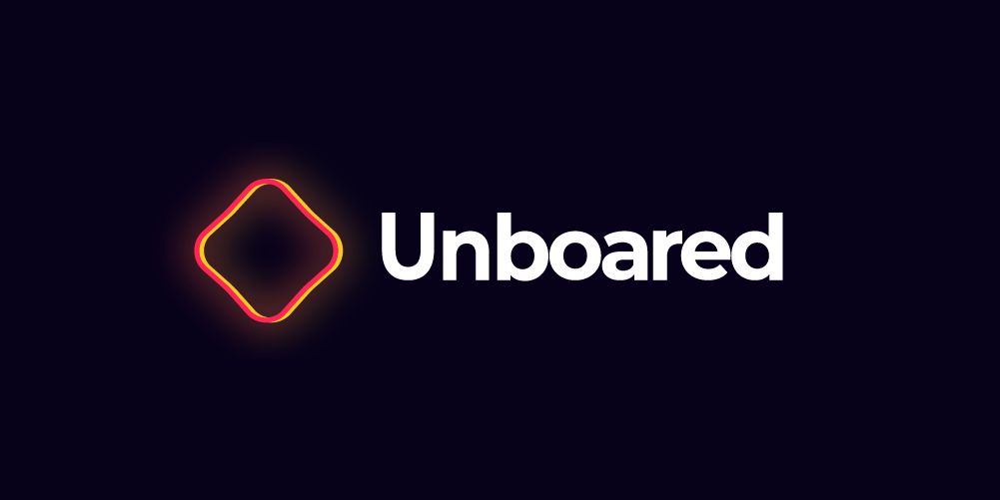

<!-- PARTIE 0 : Présentation du cours -->

<!-- _paginate: skip -->
<!-- _class: cover -->

Programmation Orientée Objet en Python

#0 Introduction 

par David Albert

2023

---

<!-- PARTIE 1 : Encadrement -->
<!-- _class: huge -->

## **01** Intervenant

**David Albert**
contact : david.albert.int@groupe-gema.com

**Expertises**
Apprentissage par renforcement
Conception et développement logiciel
Développement web

<!--
**Langages**
Français, Anglais, Python, C++, Javascript -->

---

<!-- PARTIE 2 : Motivation -->

## **02** Motivation du cours

<!-- _class: huge -->

**Approche orientée objet**
◦ Incontournable pour le développement de
systèmes complexes
◦ Mieux comprendre et maintenir le système
◦ Suivre les évolutions du système et les comparer

**Pour bien mener la conception**
◦ Besoin d'un outil de modélisation unifié - **UML**
◦ Besoin d'un langage de programmation objet - **python**

---

<!-- PARTIE 3 : Programme & organisation -->

## **03** Programme & Organisation

<!-- _class: huge -->

**Comprendre python (1 séance)**

**POO (3 séances)**
◦ Classe, objet, Encapsulation

**UML (2 séances)**
◦ Diagramme de classes
◦ Diagramme de séquence

**Projet (1 séance)**

<i class="block-icon fas fa-exclamation"></i>

Chaque cours est divisé en une partie **CM** puis une partie **TP**.

<!-- [Lien des CM](https://github.com/blavad/POO)  -->

[Lien des TP](https://github.com/blavad/POO)

 

<i class="block-icon fas fa-info"></i>

Le dernier cours est un **projet** individuel. Il permettra de se préparer à l'examen final.

---

<!-- PARTIE 4 : Evaluation -->

## **04** Evaluation

<!-- _class: huge bg2 -->

<!-- <i class="block-icon fas fa-exclamation"></i> -->

# **50%**

## Partiel

Le partiel portera sur tout ce qui a été vu pendant les 7 séances de cours.

# **30%**

## Projet

Le projet est réalisé lors de la dernière séance de cours.

Tous les supports seront autorisés.

Le but est de réaliser une étude cas informatique.

# **20%**

## Contrôle continue

Une note annexe sera également attribuée. Il pourra s'agir d'une séance de TP notée ou d'une mini étude de cas de 45min.

