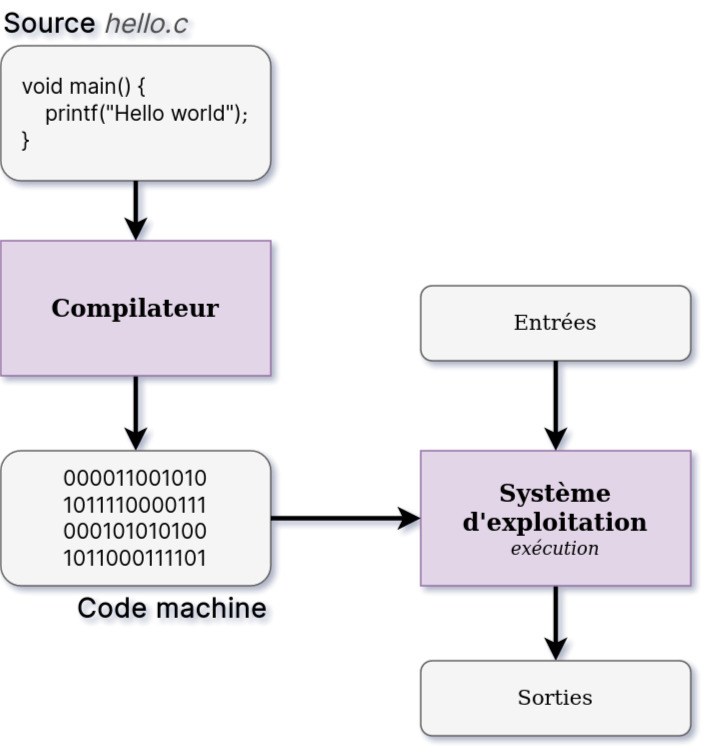

<!-- PARTIE 0 : Présentation du cours -->

<!-- _paginate: skip -->
<!-- _class: cover -->

<div class="coverBlockCenter">
<div class="coverModuleName">Programmation Orientée Objet en Python</div>
<div class="coverCourseName"><span class="important">#1 </span>Fondamentaux</div>
<div class="coverAuthor">par <span class="important">David Albert</span></div>
</div>


<div class="coverYear coverFooterRight">2023</div>

<!-- TABLE DES MATIERES -->

---

## Table des matières

<b><span class="important">01 </span> L'interpréteur python</b>
Langage compilé vs interprété. Présentation de l’interpréteur python.

<b><span class="important">02 </span>Le typage en python</b>
Typage dynamique. Bibliothèque _typing_. PEP 8.

<b><span class="important">03 </span> La gestion de paquets</b>
Description et utilisation du gestionnaire de paquet pip.

<b><span class="important">04 </span> Les environnements virtuels</b>
A quoi ça sert ? Quelques outils utiles.

<b><span class="important">05 </span>Le paradigme de la POO</b>
Principales caractéristiques du paradigme orienté objet.
Comparaison avec les autres paradigmes de programmation.

---

<!-- PARTIE 1 : INTERPRETEUR PYTHON -->

<div class="main">

# 01

## L'interpréteur python

</div>

---

## Rappel

<!-- _class: bg2 -->

<div class="flex-horizontal">
<div class="flex">

Langage humain...


</div>

<div class="flex">

Langage machine...


</div>
</div>

---

## Les langages compilés...

Dans les langages compilés, le code source (le votre) est traduit en code binaire (celui compris par l’ordinateur) grâce à un logiciel (le **compilateur**).

Le résultat de la compilation est le programme exécutable.

```bash
./monProg # on peut l'exécuter directement
```

Exemples : C, C++, Pascal, Ocaml



---

## ... et les langages interprétés...

Dans les langages interprétés, le code source (le votre) est interprété par un logiciel (l’ **interpréteur** ).

Pour exécuter notre programme, on appelle l’interpréteur.

```bash
python monProg.py # c’est l’interpréteur qui s’occupe
# de l’exécution du programme
```

Exemples: Java, **Python**, Bash


---

## L'interpréteur python

Il existe différentes [versions](https://www.python.org/downloads/) de l’interpréteur python. Quand on parle d’installer python, c’est un abus de langage, on parle en vérité d’installer l’interpréteur python (= le programme qui permet d’exécuter les fichiers écrits avec le langage python).

- Afficher les options : `python -h`
- Lancer le mode interactif : `python`
- Afficher la version : `python -V`
- Interpréter un fichier python : `python monProg.py`
- Exécuter un module : `python -m <module-name> <args>`
- Créer un environnement virtuel : `python -m venv .env`
- Installer un paquet : `python -m pip install numpy`

---

<!-- PARTIE 02 : Le typage en python -->

<div class='main'>

# 02

## Le typage en python

</div>

---

## Type dynamique

Python <i class='fas fa-arrow-right'></i> <b class='important'>typage dynamique</b>.

- pas besoin de déclarer les variables avant de pouvoir leur affecter une valeur
- les types sont portés par les valeurs et non les variables
- permet aux variables de changer de type en cours d'exécution

    <div class="w50">

  ```python
  a = 23
  a = "hello"
  ```

    </div>

<div class='block warning'>

<i class='block-icon fas fa-exclamation'></i>

Contrairement au C++, quand on assigne une variable en utilisant une autre, on ne copie pas la valeur mais une référence vers cette valeur.

Quand on modifie une valeur:

- si **type primitif** alors la **référence change**
- si **type composé** alors la **référence reste la même**

</div>

[Référence](https://librecours.net/module/js/js16/pres/co/affectation.html?mode=html)

---

## Déclarer les types

### **PEP 483**

[PEP 483](https://peps.python.org/pep-0008/) (Python Enhancement Proposals - Article 483) contient tout ce qu'il faut savoir pour déclarer nos types dans le code python. L'objectif étant de rendre le code plus compréhensible.
<i class='fas fa-arrow-right'></i> Cela n'affecte pas le fonctionnement du code.

<div class='flex-horizontal'><div class='flex'>

**1. Types primitifs et fonctions**

```python
# Déclaration typée d'une variable
ma_var : str = "Ceci est un string"

# Déclaration typée d'une fonction
def ma_function(arg1: int, arg2: float) -> bool:
    ...
```

<div class='block note'>

<i class='block-icon fas fa-info'></i>

En python, il existe 4 types primitifs:
<b class='important'>bool</b>, <b class='important'>int</b>, <b class='important'>float</b> et <b class='important'>str</b>

</div>
</div><div class='flex'>

**2. Types composites**
Après python3.10:

```python
ma_liste : list[int] = [3, 5, 7]
mon_dict : dict[str, float] = {'pressure': 4.1}
```

Avant python3.10:
On utilise `typing` pour les types composites standard: <b class='important'>list</b>, <b class='important'>dict</b>, <b class='important'>set</b>, ...

```python
from typing import List, Dict

ma_liste : List[int] = [3, 5, 7]
mon_dict : Dict[str, float] = {'pressure': 4.1}
```

---

## Déclarer les types <a src="https://docs.python.org/3/library/typing.html"><i class='fas fa-external-link'></i></a>

### **PEP 483**

<div class='flex-horizontal'><div class='flex'>

**3. Alias**

```python
Vector = list[float]

def scale(scalar: float, vector: Vector) -> Vector:
    return [scalar * num for num in vector]

# passes type checking; a list of floats qualifies as a Vector.
new_vector = scale(2.0, [1.0, -4.2, 5.4])
```

**4. Union**
Après 3.10

```python
ma-var: str | int = 4
```

Avant 3.10:

```python
from typing import Union

ma-var: Union[str, int] = 4
```

</div><div class='flex'>

**5. Généricité**

```python
from collections.abc import Sequence
from typing import TypeVar

T = TypeVar('T')                  # Declare type variable "T"

def first(l: Sequence[T]) -> T:   # Function is generic over the TypeVar "T"
    return l[0]
```

**6. Any**
Peut être de n'importe quel type
Après 3.11

```python
ma-var: Any = 4
```

Avant 3.11:

```python
from typing import Any

ma-var: Any = 4
```

</div></div>

<!--
<div class='block note'>

<i class='block-icon fas fa-info'></i>

# PEP 8
PEP 8 contient des informations sur le style à emprunter quand on code en python.

</div>
</div></div> -->

---

<!-- PARTIE 3 : GESTIONNAIRE DE PAQUETS -->
<div class="main">

# 03

## Le gestionnaire de paquets

</div>

---

## Le gestionnaire de paquets **pip**

**Pip** (package installer for Python) c'est:

- un utilitaire en ligne de commande
- permet d’installer facilement des paquets python depuis
  - le dépôt PyPi - https://pypi.org/
  - un système de contrôle de versions tel que github
  - un projet local
  - etc
- permet d’afficher les paquets python installés:
  - sur un système
  - dans un environnement virtuel

---

## Quelques commandes utiles

- Afficher les options : `pip -h`
- Installer un paquet : `pip install nomPaquet`
- Désinstaller un paquet : `pip uninstall nomPaquet`
- Afficher l'aide d’une commande : `pip <command> -h`
- Affiher la version de pip : `pip -V`
- Afficher les paquets installés : `pip list`
- Créer un fichier d’installation : `pip freeze > requirements.txt`
- Afficher les détails d’un paquet : `pip show nomPaquet`

---

<div class="main">

# 03

## Environnements virtuels

</div>

---

## Les environnements virtuels python

<!-- _class: bg2 -->

Un environnement virtuel est un **environnement d’exécution isolé**.

Il va nous permettre de **gérer plusieurs projets** sur une même machine. Certains utilisant des modules de versions différentes, voir même des versions différentes de Python.

En général, on crée un environnement virtuel pour chaque nouveau projet => il sera ainsi plus simple de gérer ses dépendances.

<br/>
<div class="flex-horizontal">
<div class="flex">

### 😀 Avantages

- Environnement d’exécution commun à tous les développeurs
- Maintenance simplifiée
- Versions de paquets spécifique au projet

</div>
<div class="flex">

### 😡 Inconvénients

- Prend plus d’espace mémoire
- Nécessite l’installation de chaque paquet à chaque nouveau projet

</div>
</div>

---

## Création et utilisation

Le module utilisé pour créer et gérer des environnements virtuels s'appelle `venv`.

(1) Créer un enviromment virtuel python 3

```bash
# python3 -m venv <env-name>
python3 -m venv .env
```

(2) Activer l'environnement virtuel

<div class='flex-horizontal'><div class='flex'>

UNIX (Linux et MacOS)

```bash
# source <env-name>/bin/activate
source .env/bin/activate
```

</div><div class='flex'>

Windows

```bash
# source <env-name>/bin/activate
.env\Scripts\activate
```

</div></div>

3. Désactiver l'environnement virtuel

```bash
deactivate
```

---

<!-- _class: bg2 -->

## Cas concret

"Il y a un mois, j’ai réalisé un projet “PredictNBA” qui utilise Pytorch v1.4, Numpy v1.25 et Flask v2.3.

Aujourd’hui, je me lance dans un nouveau projet qui utilise une nouvelle fonctionnalité de Pytorch (disponible depuis la version 2.0). Je mets donc à jour la bibliothèque Pythorch (de v1.4 à v2.0) sur mon ordinateur. Tout se passe bien, je peux désormais utiliser la nouvelle fonctionnalité.

Quelques jours plus tard, je retourne sur mon ancien projet “PredictNBA” et, catastrophe, plus rien ne fonctionne. C’est étrange, je n’ai rien changé à mon code. Je me rend rapidement compte que certaines fonctionnalités que j’utilisais dans la version 1.4 de pytorch ne sont plus disponibles dans la version 2.0.

Pour maintenir mon ancien projet, je crée donc un environnement virtuel dans lequel je réinstalle la version 1.4 de pytorch. C’est bon, tout fonctionne à nouveau."

---

<div class="main">

# 04

## Qu'est-ce que la POO ?

</div>

---

## Rappel : La programmation impérative

<b class="important">Définition</b>
La **programmation impérative** décrit les opérations d'un programme comme des séquences d'instructions exécutées par l'ordinateur pour modifier l'état du programme.

<div class="flex-horizontal">
<div class="flex">

<b class="important">Concept associés</b>

- assignation
- condition
- boucle
- branchement
- séquence d'instructions

<b class="important">Langages : </b>C, Python, PHP, Javascript

</div>
<div class="flex">

<b class="important">Exemple</b>

```python
pTomatoes = 2.80
pPotatoes = 3.68

def addition(a, b):
    return a + b

pTotal = addition(pTomatoes, pPotatoes)

if (pTotal > 10):
    print("C'est cher")
else:
    print("C'est pas cher")
```

</div>
</div>

---

## La programmation orientée objet

<b class="important">Définition</b>
La **programmation orienté objet (POO)** décrit les opérations d'un programme grâce à la définition et l’interaction de briques logicielles appelées _objets_. En POO, on cherche à représenter ces objets et leurs relations.

<div class="flex-horizontal">
<div class="flex">

<b class="important">Concept associés</b>

- classes et instances
- encapsulation
- abstraction
- héritage
- polymorphisme

<b class="important">Langages : </b> Java, Python, C++

</div>
<div class="flex">

<b class="important">Intérêts</b>

- Modularité et réutilisabilité
- Facilité de compréhension
  - plus proche du langage parlé
- Code flexible et extensible

</div>
</div>

---

## La programmation orientée objet

<div class="flex-horizontal">
<div class="flex">

<b class="important">Exemple</b>

1. Instanciation et appel de méthodes

```python
cart = ShoppingCart(max=10)
cart.addItem(Item('tomatoes', 2.80))
cart.addItem(Item('potatoes', 3.68))

if (cart.isExpensive()):
    print("C'est cher")
else:
    print("C'est pas cher")
```

2. Déclaration de la classe `Item`

```python
class Item:
    def __init__(self, name, price):
        self.name = name
        self.price = price

    def getPrice(self):
        return self.price
```

</div>
<div class="flex">

3. Déclaration de la classe `ShoppingCart`

```python
class ShoppingCart:
    def __init__(self, max):
        self.cart = []
        self.maxPrice = max

    def addItem(self, item):
        self.cart.append(item)

    def getPrice(self):
        tot = 0.
        for item in self.cart:
            tot += item.getPrice()
        return tot

    def isExpensive(self):
        return self.getPrice() > self.maxPrice
```

</div>
</div>

---

## Autres : La programmation fonctionnelle

<b class="important">Définition</b>
La **programmation fonctionnelle** décrit les opérations d'un programme exclusivement à l’aide de _fonctions_. Les données du programme sont ainsi immutables (elles ne sont pas modifiées après leur création).

<div class="flex-horizontal">
<div class="flex">

<b class="important">Concept associés</b>

- immuabilité des données
- fonctions pures
- fonctions d’ordre supérieur
- récursivité
- map, filter & reduce

<b class="important">Langages :</b> Ocaml, LISP

</div>
<div class="flex">

<b class="important">Intérêts</b>

- Prévisible et simple à tester
- Parrallélisme : Pas de risque de conflits de données

</div>
</div>

---

## Encore plus de paradigmes

**Programmation logique**
Décrit les opérations d’un programme à l’aide de faits et les règles logiques. Cela permet de déduire des conclusions à partir d'un ensemble de faits et de requêtes.
<i class="important">Langages:</i> Prolog

**Programmation descriptive**
Décrit une application et/ou des structures de données sans état interne.
<i class="important">Langages</i>: HTML, LaTex

<div class="block note">

<i class="block-icon fas fa-info"></i>

# Notes

La plupart des langages sont **multi-paradigmes**, c'est-à-dire qu'ils supportent simultanément plusieurs paradigmes: impératif, orienté objet, fonctionnel, etc.

C’est notamment le cas du **Python**.

</div>

---

<!-- _class: bg2 -->

## Comparaison paradigmes de programmation

|                |                           prog. impérative                           |                                prog. orientée objet                                 |                   prog. fonctionnelle                   |
| :------------: | :------------------------------------------------------------------: | :---------------------------------------------------------------------------------: | :-----------------------------------------------------: |
|   Popularité   |                   le plus courant et le plus vieux                   |                             le plus flexible et lisible                             |                      le plus sûre                       |
| Le développeur |  décrit de façon séquentielle comment un programme doit travailler   |               décrit des concepts et les relations entre ces concepts               | décrit le programme exclusivement à l’aide de fonctions |
|   Mots clés    | assignation, condition, boucle, branchement, séquence d’instructions | classe, instance, constructeur, encapsulation, abstraction, héritage, polymorphisme | immuable, fonctions pures, fonctions d’ordres supérieur |
|    Langages    |                      C, Python, PHP, Javascript                      |                                  Java, Python, C++                                  |                     OCaml, LISP, ML                     |

<script type="module">
import mermaid from 'https://cdn.jsdelivr.net/npm/mermaid@10.0.0/dist/mermaid.esm.min.mjs';
mermaid.initialize({ startOnLoad: true });

window.addEventListener('vscode.markdown.updateContent', function() { mermaid.init() });
</script>
