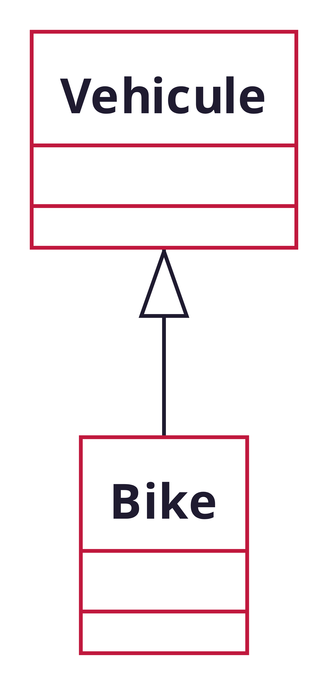

<!-- PARTIE 0 : Présentation du cours -->

<!-- _paginate: skip -->
<!-- _class: cover -->

<div class="coverBlockCenter">
<div class="coverModuleName">Programmation Orientée Objet en Python</div>
<div class="coverCourseName"><span class="important">#2 </span>Encapsulation</div>
<div class="coverAuthor">par <span class="important">David Albert</span></div>
</div>


<div class="coverYear coverFooterRight">2023</div>

<!-- TABLE DES MATIERES -->

---

## Table des matières

<b><span class="important">01 </span> Classes et objets</b>
Classes. Objets. Attributs et méthodes. Instances.

<b><span class="important">02 </span> Constructeur</b>
Constructeur. Constructeur par défaut.

<b><span class="important">03 </span> Encapsulation</b>
Données privées, publiques. Getter / Setter. Mot-clé self.

<b><span class="important">04 </span> Héritage</b>
Héritage. Classe abstraites. Interfaces.

<b><span class="important">05 </span> Built-in functions</b>
Fonctions intégrées : \_\_init\_\_, \_\_str\_\_, \_\_eq\_\_, ...

---

<!-- PARTIE 1 : OBJETS ET CLASSES -->

<div class="main">

# 01

## Classes et objets

</div>

---

## Les classes

Une <b class="important">classe</b> est un **type de données composite** constitué:

- de données que l’on appelle <b class="important">attributs</b> (des variables primitives ou des objets)
- de <b class="important">méthodes</b> permettant de traiter ces données et des données extérieures à la classe

<div class="flex-horizontal">
<div class="flex">

**Syntaxe UML**


</div>
<div class="flex">

**Syntaxe python**

```python
class CitroenC3:
    def __init__(self):
        self._id = 0
        self._currentSpeed = 0
        self._maxSpeed = 210
        self._year = 2010

    def accelerate(self):
        pass

    def turnLeft(self, deg):
        pass

    def turnRight(self, deg):
        pass
```

</div>
</div>

---

## Les objets

Un <b class="important">objet</b> est une **variable** dont le type est une classe particulière
<i class='fas fa-arrow-right'></i> on parle d'une <b class="important">instance de classe</b>.

<div class="flex-horizontal">
<div class="flex">

**Syntaxe UML**


</div>
<div class="flex">

**Syntaxe Python**

Pour instancier un objet en python on fait appel à une méthode particulière: le <b class="important">constructeur</b>.

```python
  myCar : CitroenC3 = CitroenC3()
# ------   ---------   -----------
# objet     classe     constructeur
```

<div class="block note">
    
<i class="block-icon fas fa-info"></i>

Dans un même programme il y a généralement plusieurs instances d'une même classe.

</div>

</div>
</div>

---

## Objets et classes

<b class="important">Différence classe et objet</b>

<div class="block note">
    
<i class="block-icon fas fa-info"></i>

# Pour mieux comprendre

**Classe =** Le moule pour fabriquer des objets = type de données contenant des données (attributs) et des fonctions (méthodes)

**Objet =** une instance de classe (l’objet une fois créé) = une donnée spécifique

</div>

---

<!-- PARTIE 3 : ENCAPSULATION -->

<div class="main">

# 02

## Constructeur : **\_\_init\_\_**

</div>

---

## Constructeur

Le <b class="important">constructeur</b> est une méthode spéciale (**\_\_init\_\_** en python) qui est appelée au moment de la création de l'objet.

<div class="flex-horizontal">
<div class="flex">

**Définition du constructeur**

```python
class Music:
    # Définition du constructeur
    def __init__(self, title, artists):
        self._title = title
        self._artists = artists

    def hasAuthor(self, name):
        return name in self._artists
```

</div>

<div class="flex">

**Appel du constructeur**

```python
# Instanciation d'un objet de type 'Music'
m = Music('La pluie', ['Stromae', 'Orelsan'])

print(m.hasAuthor('Stromae'))
# true
```

</div>

</div>

<div class='block note'>

<i class='block-icon fas fa-info'></i>

Le constructeur permet de configurer l'instance.

</div>

---

## Constructeur par défaut

Le constructeur (comme toute fonction) peut prendre des arguments par défaut.

<div class="flex-horizontal">
<div class="flex">

**Définition du constructeur**

```python
class Music:
    # Définition du constructeur
    # avec arguments par défaut
    def __init__(self, title, artists = []):
        self._title = title
        self._artists = artists

    def hasAuthor(self, name):
        return name in self._artists
```

</div>

<div class="flex">

**Appel du constructeur par défaut**

```python
# Appel du constructeur par défaut
m2 = Music('La pluie')

print(m.hasAuthor('Stromae'))
# false
```

</div>

</div>

---

<!-- PARTIE 3 : ENCAPSULATION -->

<div class="main">

# 03

## Encapsulation

</div>

---

## Encapsulation

### **Princpe**

<!-- _class: bg2 -->

<div class="flex-horizontal">
<div class="flex">

Usage simple et visible


</div>

<div class="flex">

Fonctionnement complexe et caché


</div>
</div>

---

## Visibilité des attributs et méthodes

L’encapsulation de données dans un objet permet de cacher ou non leur existence aux autres objets du programme.

Une donnée peut être déclarée en accès :

- **public** : les autres objets peuvent accéder à la valeur de cette donnée ainsi que la modifier

- **protégé** : l’accès aux données est réservé aux fonctions des classes héritières

- **privé** : l’accès aux données est limité aux méthodes de la classe elle-même

<div class="block warning">
    
<i class="block-icon fas fa-exclamation"></i>

Par convention en _python_ :

- attributs et méthodes **public** par défaut
- attributs et méthodes **protégés** commencent par un simple underscore **\_**
  Exemple: `_increaseSpeed()`

- attributs et méthodes privés commencent par un double underscore **\_\_**
  Exemple: `__currentSpeed`

</div>

</div>
</div>

---

## Encapsulation

### **Parallèle avec les objets du quotidien**


---

## Encapsulation

### **Bonnes pratiques**

- ne rendre publique que le stricte nécessaire
  - les fonctions nécessaires à l’usage (`accelerate`, `turnLeft`, `turnRight`)
  - et pas plus (`__currentSpeed`, `_increaseSpeed`, `_turnLeftWheel`)
- n’utiliser que des **attributs privés ou protégés**
  - utiliser un **getter** si besoin de lire depuis l’extérieur
  - utiliser un **setter** si besoin de modifier depuis l’extérieur
- suivre le principe de **responsabilité unique** - **S** de **S**OLID
  - exemple [Animal / AnimalDB](https://gist.github.com/dmmeteo/f630fa04c7a79d3c132b9e9e5d037bfd)

---

## Encapsulation

### **get, set, self**

<div class="flex-horizontal">
<div class="flex" style="margin-right:1rem">

**Getters / Setters**

```python
class Music:
    def __init__(self, title, duration = 0):
        self._title = title
        self._duration = duration

    # Ceci est un getter
    def get_title(self, name):
        return self._title

    # Ceci est un setter
    def set_title(self, title):
        self._title = title

```

</div>
<div class="flex">

**Mot clé** <b class="important">self </b>

Utilisé pour accéder à l'instance d'une classe. On pourra l'utiliser dans la méthode pour accéder aux données.

<div class="block warning">
<i class="block-icon fas fa-exclamation"></i>

Il doit impérativement être le **premier argument** de chaque méthode d'instance.

</div>

</div>

</div>

---

<!-- PARTIE 4 : Héritage -->

<div class="main">

# 04

## Héritage

</div>

---

## Héritage

En POO, l'<b class="important">héritage</b> est le concept qui permet de créer une nouvelle classe à partir d'une classe existante.

<div class="flex-horizontal">
<div class="flex">

**Syntaxe UML**
La classe `Bike` hérite de la classe `Vehicule`.
La classe <b class="important">fille</b> est `Bike`.
La classe <b class="important">parente</b> est `Vehicule`.



</div>
<div class="flex">

**Syntaxe python**

```python
class Vehicule(ABC): # ici on définit la classe mère
    def __init__(self, wheels, brand):
        self._brand = brand
        self._wheels = wheels

    def accelerate(self):
        print("Go !")

class Bike(Vehicule): # class fille
    def __init__(self):
        super().__init__(2, "Canyon")
```

En héritant de `Vehicule`, la classe `Bike` hérite de ses méthodes.

```python
b = Bike()
b.accelerate()
# Go !
```

</div>
</div>

---

## Classe abstraite

**Définition**
Une <b class="important">classe abstraite</b> est une classe qui comprend **au moins** une méthode **non implémentée**.

<div class="flex-horizontal">
<div class="flex" style="flex:0.4;">

**Syntaxe UML**


<div class='block note'>

<i class='block-icon fas fa-info'></i>

Les méthodes abstraites sont écrites en _italique_. A la main, on <u>souligne</u>.

</div>

</div>
<div class="flex" style="flex:0.6">

**Intérêt**

- Implémenter certains opérationes communes à un groupe d'objets malgré que le concept soit encore _abstrait_

**Syntaxe python**

```python
from abc import ABC, abstractmethod

class Vehicule(ABC):
    def accelerate(self):
        print("Go !")

    def turnLeft(self):
        print("Go left !")

    @abstractmethod
    def isFrenchBrand(self):
        pass
```

</div>
</div>

---

## Interface

**Définition**
Une <b class="important">interface</b> est une classe abstraite particulière. Elle ne contient **aucun attribut** et ses méthodes ne sont **pas implémentées**.

<div class="flex-horizontal">
<div class="flex" style="flex:80">

<div class='flex-horizontal'><div class='flex' style='flex:0.9'>

**Intérêts**

- Définir les opérations sans préciser leur implémentation
- Préciser les conditions et les effets de l'invocation des opérations

</div><div class='flex' style='flex:0.1'>

**Syntaxe UML**


</div></div>

<div class="block warning">

<i class="block-icon fas fa-exclamation"></i>

Les **classes abstraites** et les **interfaces** ne seront **jamais instanciées** directement.

</div>

</div>

<div class="flex" style="flex:35">

**Syntaxe python**

```python
from abc import ABC, abstractmethod

class Vehicule(ABC):
    @abstractmethod
    def accelerate(self):
        pass

    @abstractmethod
    def turnLeft(self):
        pass

    @abstractmethod
    def isFrenchBrand(self):
        pass
```

</div>
</div>

---

<!-- PARTIE 3 : ENCAPSULATION -->

<div class="main">

# 05

## Built-in functions

</div>

---

## La classe `object`

Depuis python 3, tous les types pythons de bases (**int**, **float**, **str**, **list**, **dict**, **set**, ...) sont des classes qui héritent de la même classe racine: la classe **object**.

La classe **object** contient un certains nombres de méthodes intégrées (les **built-in functions**).

<div class='block note'>

<i class='block-icon fas fa-info'></i>

Quand on crée une classe en python, celle-ci hérite par défaut de de cette classe **object** et donc, on peut redéfinir les fonctions built-in dans l'implémentation.

</div>

---

<h2>(1) Built-in functions  <a href="https://www.w3schools.com/python/python_ref_functions.asp"><i class="fa fa-external-link"></i></a> </h2>

Toute classe python contient un ensemble de méthodes intégrées (ou **built-in**).

- **\_\_init\_\_** : retourne une instance de la classe
  `MyClass()` ou `obj.__init__()`

- **\_\_str\_\_** : retourne une représentation lisible pour l'humain de l'objet
  `str(obj)` ou `obj.__str__()`

- **\_\_repr\_\_** : retourne une représentation machine de l'objet
  `repr(obj)` ou `obj.__repr__()`

- **\_\_len\_\_** : retourne la longueur de l'objet
  `len(obj)` ou `obj.__len__()`

</br>
</br>

<div class="block note">
<i class="block-icon fas fa-info"></i>

On peut redéfinir chacune de ces méthodes pour un usage personnalisé.

</div>

---

<h2>(2) Built-in functions  <a href="https://www.w3schools.com/python/python_ref_functions.asp"><i class="fa fa-external-link"></i></a> </h2>

Toute classe python contient un ensemble de méthodes intégrées (ou **built-in**).

- **\_\_eq\_\_** : redéfinit l'opérateur d'égalité
  `obj1 == obj2` ou `obj1.__eq__(obj2)`

- **\_\_le\_\_** : redéfinit l'opérateur inférieur ou égal
  `obj1 <= obj2` ou `obj1.__le__(obj2)`

- **\_\_ue\_\_** : redéfinit l'opérateur supéreur ou égal
  `obj1 >= obj2` ou `obj1.__ue__(obj2)`

- **\_\_lt\_\_** : redéfinit l'opérateur inférieur strict
  `obj1 < obj2` ou `obj1.__lt__(obj2)`

- **\_\_ut\_\_** : redéfinit l'opérateur supéreur strict
  `obj1 > obj2` ou `obj1.__ut__(obj2)`

<div class="block note">
<i class="block-icon fas fa-info"></i>

On peut redéfinir chacune de ces méthodes pour un usage personnalisé.

</div>

<script type="module">
import mermaid from 'https://cdn.jsdelivr.net/npm/mermaid@10.0.0/dist/mermaid.esm.min.mjs';
mermaid.initialize({ startOnLoad: true });

window.addEventListener('vscode.markdown.updateContent', function() { mermaid.init() });
</script>
