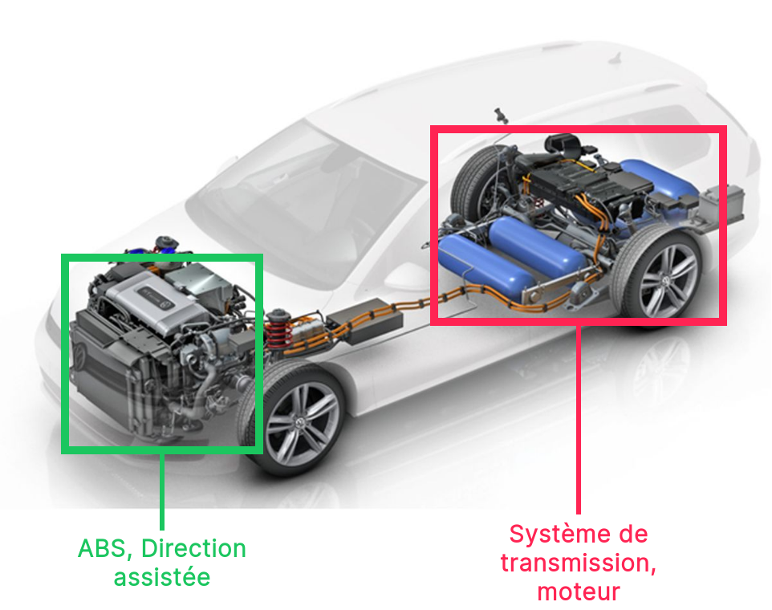

<!-- PARTIE 0 : Présentation du cours -->

<!-- _paginate: skip -->
<!-- _class: cover -->

<div class="coverBlockCenter">
<div class="coverModuleName">Programmation Orientée Objet en Python</div>
<div class="coverCourseName"><span class="important">#2 </span>Encapsulation</div>
<div class="coverAuthor">par <span class="important">David Albert</span></div>
</div>


<div class="coverYear coverFooterRight">2023</div>


<!-- TABLE DES MATIERES -->
--- 

## Table des matières 

<b><span class="important">01 </span> Classes et objets</b>
Classes. Objets. Attributs et méthodes. Instances.


<b><span class="important">02 </span> Encapsulation</b>
Données privées, publiques. Getter / Setter. Mot-clé self. 


<b><span class="important">03 </span> Instanciation</b>
Constructeur. Constructeur par défaut.


<b><span class="important">03 </span> Built-in functions</b>
Fonctions intégrées : \_\_init__, \_\_str__, \_\_eq__, ...

---
<!-- PARTIE 1 : OBJETS ET CLASSES -->

<div class="main">

# 01 

## Classes et objets

</div>

---

## Les classes

Une <b class="important">classe</b> est un **type de données composite**  constitué:
- de données que l’on appelle <b class="important">attributs</b> (des variables primitives ou des objets)
- de <b class="important">méthodes</b> permettant de traiter ces données et des données extérieures à la classe

<div class="flex-horizontal">
<div class="flex">

**Syntaxe UML**


</div>
<div class="flex">

**Syntaxe python**

```python
class CitroenC3:
    def __init__(self):
        self._id = 0
        self._currentSpeed = 0 
        self._maxSpeed = 210
        self._year = 2010
    
    def accelerate(self):
        pass

    def turnLeft(self, deg):
        pass

    def turnRight(self, deg):
        pass
```

</div>
</div>


--- 
## Les objets

Un <b class="important">objet</b> est une **variable** dont le type est une classe particulière 
<i class='fas fa-arrow-right'></i> on parle <b class="important">instance de classe</b>. 


<div class="flex-horizontal">
<div class="flex">

**Syntaxe UML**


</div>
<div class="flex">

**Syntaxe Python**

Pour instancier un objet en python on fait appel à une méthode particulière: le <b class="important">constructeur</b>.

```python 
  myCar : CitroenC3 = CitroenC3()
# ------   ---------   -----------
# objet     classe     constructeur
```

<div class="block note">
    
<i class="block-icon fas fa-info"></i> 

Dans un même programme il y a généralement plusieurs instances d'une même classe.

</div>

</div>
</div>


---

## Objets et classes

<b class="important">Différence classe et objet</b>

<div class="block note">
    
<i class="block-icon fas fa-info"></i> 

# Pour mieux comprendre

**Classe =** Le moule pour fabriquer des objets = type de données contenant des données (attributs) et des fonctions (méthodes)

**Objet =** une instance de classe (l’objet une fois créé) = une donnée spécifique

</div>

---
<!-- PARTIE 2 : ENCAPSULATION -->

<div class="main">

# 02 

## Encapsulation

</div>


---
## Princpe

<!-- _class: bg2 -->

<div class="flex-horizontal">
<div class="flex">

Usage simple et visible 


</div>

<div class="flex">

Fonctionnement complexe et caché



</div>
</div>


---

## Visibilité des attributs et méthodes

L’encapsulation de données dans un objet permet de cacher ou non leur existence aux autres objets du programme. 

Une donnée peut être déclarée en accès :

- **public** : les autres objets peuvent accéder à la valeur de cette donnée ainsi que la modifier

- **privé** : les autres objets n’ont pas le droit d’accéder directement à la valeur de cette donnée (ni de la modifier). En revanche, ils peuvent le faire indirectement par grâce aux méthodes publiques de l’objet concerné


<div class="block warning">
    
<i class="block-icon fas fa-exclamation"></i> 

Par convention, les attributs et méthodes privés commencent par **_** en *python*.

Exemple: `_currentSpeed` et `_increaseSpeed()`
</div>

</div>
</div>


---

## Bonnes pratiques

- ne rendre publique que le stricte nécessaire
  - les fonctions nécessaires à l’usage (`accelerate`, `turnLeft`, `turnRight`)
  - et pas plus (`_increaseSpeed`, `_turnLeftWheel`) 
- n’utiliser que des **attributs privés** 
  -  utiliser un **getter** si besoin de lire depuis l’extérieur
  - utiliser un **setter** si besoin de modifier depuis l’extérieur
- suivre le principe de **responsabilité unique** - **S** de **S**OLID
    - exemple [Animal / AnimalDB](https://gist.github.com/dmmeteo/f630fa04c7a79d3c132b9e9e5d037bfd) 


---

## Encapsulation

<div class="flex-horizontal">
<div class="flex" style="margin-right:1rem">

**Getters / Setters**

```python
class Music:
    def __init__(self, title, duration = 0):
        self._title = title
        self._duration = duration

    # Ceci est un getter
    def get_title(self, name):
        return self._title

    # Ceci est un setter
    def set_title(self, title):
        self._title = title

```

</div>
<div class="flex">

**Mot clé** <b class="important">self </b>

Utilisé pour accéder à l'instance d'une classe. On pourra l'utiliser dans la méthode pour accéder aux données.

<div class="block warning">
<i class="block-icon fas fa-exclamation"></i>

Il doit impérativement être le **premier argument** de chaque méthode.

</div>

</div>

</div>

---
<!-- PARTIE 3 : ENCAPSULATION -->

<div class="main">

# 03

## Constructeur : **\_\_init__**

</div>


---

## Constructeur

Le <b class="important">constructeur</b> est une méthode spéciale (**\_\_init__** en python) qui est appelée au moment de la création de l'objet.

<div class="flex-horizontal">
<div class="flex">

**Définition du constructeur**

```python
class Music:
    # Définition du constructeur
    def __init__(self, title, artists):
        self._title = title
        self._artists = artists

    def hasAuthor(self, name):
        return name in self._artists
```

</div>

<div class="flex">

**Appel du constructeur**

```python
# Instanciation d'un objet de type 'Music' 
m = Music('La pluie', ['Stromae', 'Orelsan'])

print(m.hasAuthor('Stromae'))
# true
```

</div>

</div>


---

## Constructeur par défaut

Le constructeur (comme toute fonction) peut prendre des arguments par défaut.

<div class="flex-horizontal">
<div class="flex">

**Définition du constructeur**

```python
class Music:
    # Définition du constructeur
    # avec arguments par défaut
    def __init__(self, title, artists = []):
        self._title = title
        self._artists = artists

    def hasAuthor(self, name):
        return name in self._artists
```

</div>

<div class="flex">

**Appel du constructeur par défaut**

```python
# Appel du constructeur par défaut
m2 = Music('La pluie')

print(m.hasAuthor('Stromae')) 
# false
```

</div>

</div>


---
<!-- PARTIE 3 : ENCAPSULATION -->

<div class="main">

# 04

## Built-in functions

</div>


---
<h2>(1) Built-in functions  <a href="https://www.w3schools.com/python/python_ref_functions.asp"><i class="fa fa-external-link"></i></a> </h2> 

Toute classe python contient un ensemble de méthodes intégrées (ou **built-in**). 

- **\_\_init__** : retourne une instance de la classe 
  `MyClass()` ou `obj.__init__()`

- **\_\_str__** : retourne une représentation lisible pour l'humain de l'objet
  `str(obj)` ou `obj.__str__()`

- **\_\_repr__** : retourne une représentation machine de l'objet
  `repr(obj)` ou `obj.__repr__()`

- **\_\_len__** : retourne la longueur de l'objet
  `len(obj)` ou `obj.__len__()`

<div class="block note">
<i class="block-icon fas fa-info"></i>

On peut redéfinir chacune de ces méthodes pour un usage personnalisé.

</div>


---
<h2>(2) Built-in functions  <a href="https://www.w3schools.com/python/python_ref_functions.asp"><i class="fa fa-external-link"></i></a> </h2> 

Toute classe python contient un ensemble de méthodes intégrées (ou **built-in**). 

- **\_\_eq__** : redéfinit l'opérateur d'égalité 
  `obj1 == obj2` ou `obj1.__eq__(obj2)`

- **\_\_le__** : redéfinit l'opérateur inférieur ou égal 
  `obj1 <= obj2` ou `obj1.__le__(obj2)`

- **\_\_ue__** : redéfinit l'opérateur supéreur ou égal 
  `obj1 >= obj2` ou `obj1.__ue__(obj2)`

- **\_\_lt__** : redéfinit l'opérateur inférieur strict
  `obj1 < obj2` ou `obj1.__lt__(obj2)`

- **\_\_ut__** : redéfinit l'opérateur supéreur strict
  `obj1 > obj2` ou `obj1.__ut__(obj2)`


<div class="block note">
<i class="block-icon fas fa-info"></i>

On peut redéfinir chacune de ces méthodes pour un usage personnalisé.

</div>


<script type="module">
import mermaid from 'https://cdn.jsdelivr.net/npm/mermaid@10.0.0/dist/mermaid.esm.min.mjs';
mermaid.initialize({ startOnLoad: true });

window.addEventListener('vscode.markdown.updateContent', function() { mermaid.init() });
</script>