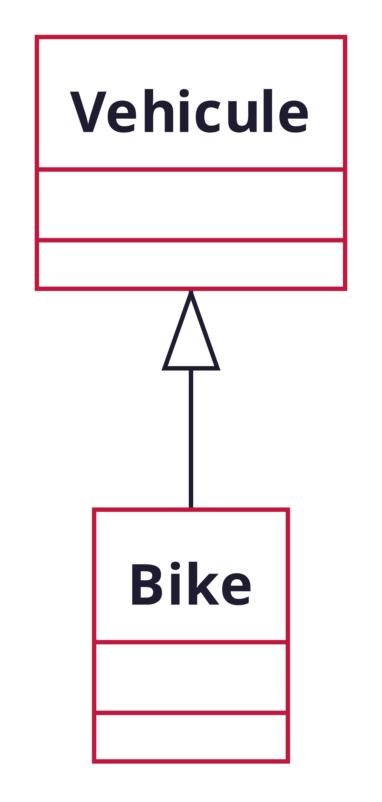
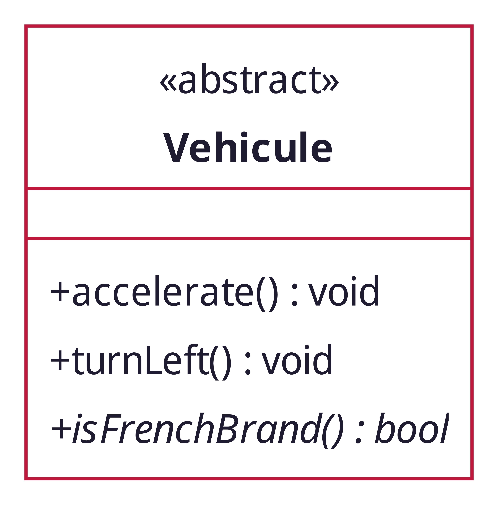
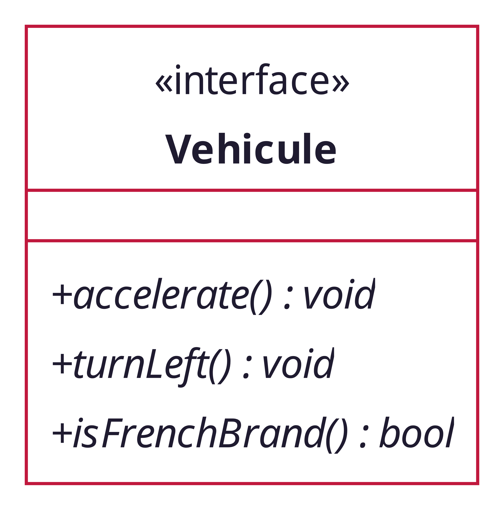
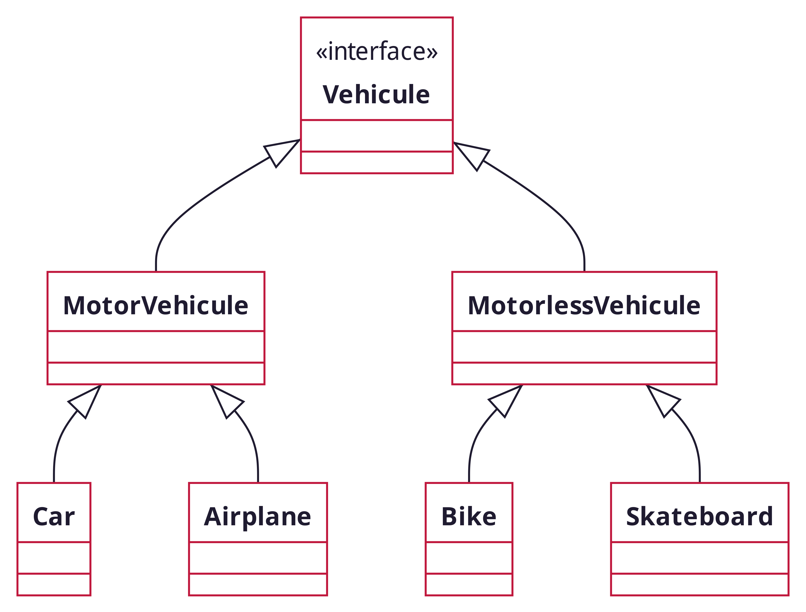

<!-- PARTIE 0 : Présentation du cours -->

<!-- _paginate: skip -->
<!-- _class: cover -->

<div class="coverBlockCenter">
<div class="coverModuleName">Programmation Orientée Objet en Python</div>
<div class="coverCourseName"><span class="important">#3 </span>Polymorphisme</div>
<div class="coverAuthor">par <span class="important">David Albert</span></div>
</div>


<div class="coverYear coverFooterRight">2023</div>

<!-- TABLE DES MATIERES -->

---

## Table des matières

<b><span class="important">01 </span> Héritage</b>
Héritage. Classe abstraites. Interfaces.

<b><span class="important">02 </span> Polymorphisme</b>
Définition. Spécialisation. Surcharge de méthodes.

<b><span class="important">03 </span> Héritage multiple</b>
Héritage multiple. Ordre d'héritage.

<b><span class="important">04 </span> Méthodes de classes</b>
Attribut / méthodes de classes. Décorateur **_@classmethod_**. Mot-clé **cls**.

---

<!-- PARTIE 1 : Héritage -->

<div class="main">

# 01

## Héritage

</div>

---

## Héritage

En POO, l'<b class="important">héritage</b> est le concept qui permet de créer une nouvelle classe à partir d'une classe existante.

<div class="flex-horizontal">
<div class="flex">

**Syntaxe UML**
La classe `Bike` hérite de la classe `Vehicule`.
La classe <b class="important">fille</b> est `Bike`.
La classe <b class="important">parente</b> est `Vehicule`.



</div>
<div class="flex">

**Syntaxe python**

```python
class Vehicule: # ici on définit la classe mère
    def __init__(self, wheels, brand):
        self._brand = brand
        self._wheels = wheels

    def accelerate(self):
        print("Go !")

class Bike(Vehicule): # class fille
    def __init__(self):
        super().__init__(2, "Canyon")
```

En héritant de `Vehicule`, la classe `Bike` hérite de ses méthodes.

```python
b = Bike()
b.accelerate()
# Go !
```

</div>
</div>

---

## Classe abstraite

**Définition**
Une <b class="important">classe abstraite</b> est une classe qui comprend **au moins** une méthode **non implémentée**.

<div class="flex-horizontal">
<div class="flex" style="flex:0.4;">

**Syntaxe UML**



<div class='block note'>

<i class='block-icon fas fa-info'></i>

Les méthodes abstraites sont écrites en _italique_. A la main, on <u>souligne</u>.

</div>

</div>
<div class="flex" style="flex:0.6">

**Intérêt**

- Implémenter certains opérationes communes à un groupe d'objets malgré que le concept soit encore _abstrait_

**Syntaxe python**

```python
class Vehicule:
    def accelerate(self):
        print("Go !")

    def turnLeft(self):
        print("Go left !")

    def isFrenchBrand(self):
        raise NotImplementedError("The method is abstract")

```

</div>
</div>

---

## Interface

**Définition**
Une <b class="important">interface</b> est une classe abstraite particulière. Elle ne contient **aucun attributs** et ses méthodes ne sont **pas implémentées**.

<div class="flex-horizontal">
<div class="flex" style="flex:0.4">

**Intérêts**

- Définir les opérations sans préciser leur implémentation
- Préciser les conditions et les effets de l'invocation des opérations
</div>
<div class="flex" style="flex:0.2">

**Syntaxe UML**


</div>

<div class="flex" style="flex:0.4">

**Syntaxe python**

```python
class Vehicule:
    def accelerate(self):
        raise NotImplementedError("The method is abstract")

    def turnLeft(self):
        raise NotImplementedError("The method is abstract")

    def isFrenchBrand(self):
        raise NotImplementedError("The method is abstract")

```

Les méthodes abstraites renvoient une erreur.

</div>
</div>

<div class="block warning">

<i class="block-icon fas fa-exclamation"></i>

Les **classes abstraites** et les **interfaces** ne seront **jamais instanciées** directement.

</div>

---

<!-- PARTIE 2 : Polymorphisme -->

<div class="main">

# 02

## Polymorphisme

</div>

---

## Polymorphisme

<div class="flex-horizontal">
<div class="flex">

En POO, le <b class="important">polymorphisme</b> est le concept qui permet de **modifier le comportement** d’une classe fille par rapport à sa classe mère.

Cela permet d’utiliser l’héritage comme:

- mécanisme de **spécialisation** d'un concept.
- mécanisme d’**extension du système**.

<div class="block note">
<i class="block-icon fas fa-info"></i>

**Bonne pratique**

1. On définit une **interface commune** à une famille d'objets (la classe de base).

2. On écrit les **détails d'implémentations** des classes spécialisées.
</div>
</div>
<div class="flex" style="flex:0.5;">

<h4 style="text-align:center; font-style:italic;">Polymorphisme</h4>
<p style="text-align:center;; font-style:italic;">"qui peut prendre plusieurs formes"</p>


<!--  -->
</div>
</div>

---

## Surcharger une méthode

**Mot-clé <span class="important">super</span>**

# **_TO DO_**

---

## Polymorphisme en pratique (1)

<div class="flex-horizontal">
<div class="flex">



</div>
<div class="flex">

On surcharge la méthode `accelerate`.

```python
class Vehicule:
    def accelerate(self):
        raise NotImplementedError("The method is abstract")

class MotorlessVehicule(Vehicule):
    def accelerate(self):
        print("Go cleanly !")

class Bike(MotorlessVehicule):
    def accelerate(self):
        print("Go cleanly by bike!")

class Bike(MotorlessVehicule):
    def accelerate(self):
        print("Go cleanly by skate!")
```

L'implémentation d'`accelerate` n'est pas la même pour un vélo et un skateboard.

</div>
</div>

---

## Polymorphisme en pratique (2)

Nous pouvons appeler la méthode `accelerate` d'un objet sans nous soucier de son type intrinsèque.

```python
vehicules : list[Vehicule] = []
vehicules.append(Car())
vehicules.append(Skateboard())

for v in vehicules:
    v.accelerate()

# OUTPUT
# Go cleanly by bike!
# Go cleanly by skate!
```

---

<!-- PARTIE 2 : Polymorphisme -->

<div class="main">

# 03

## Héritage multiple

</div>

---

## Héritage multiple

# **_TO DO_**

---

## Ordre d'héritage

Afin de pouvoir déboguer lors d'erreurs avec l'héritage multiple, il est possible de connaître l'ordre d'héritage. Pour cela, on utilise la méthode `__mro__`.

```python
class A():
    pass

class B():
    pass

class C(A, B):
    pass

if __name__ == '__main__':
    # Attention, __mro__ est un attribut de classe.
    # Il doit donc etre recupere depuis la classe
    print(C.__mro__)
```

L'exécution de ce code renvoit

```bash
(<class '__main__.C'>, <class '__main__.A'>, <class '__main__.B'>, <type 'object'>)
```

---

### Order d'héritage

<div class="flex-horizontal">
<div class="flex">

**Exercice**

```python
class A():
    pass

class B():
    pass

class C(A, B):
    pass

class D(B,A):
    pass

class E(D,A):
    pass

class F(C, D, B):
    pass


```

</div>
<div class="flex">

**Question 1 :** Qu'affiche ce programme ?

```python
print(C.__mro__)
```

**Question 2 :** Qu'affiche ce programme ?

```python
print(D.__mro__)
```

**Question 3 :** Qu'affiche ce programme ?

```python
print(E.__mro__)
```

**Question 4 :** Qu'affiche ce programme ?

```python
print(G.__mro__)
```

</div>
</div>

---

### Order d'héritage

<div class="flex-horizontal">
<div class="flex">

**Exercice**

```python
class A():
    pass

class B():
    pass

class C(A, B):
    pass

class D(B,A):
    pass

class E(D,A):
    pass

class F(E, D):
    pass

class G(F, B):
    pass

```

</div>
<div class="flex">

**Réponse 1 :**

```
(<class '__main__.C'>, <class '__main__.A'>, <class '__main__.B'>, <class 'object'>)
```

**Réponse 2 :**

```
(<class '__main__.D'>, <class '__main__.B'>, <class '__main__.A'>, <class 'object'>)
```

**Réponse 3 :**

```
(<class '__main__.E'>, <class '__main__.D'>, <class '__main__.B'>, <class '__main__.A'>,
<class 'object'>)
```

**Réponse 4 :**

```
(<class '__main__.G'>, <class '__main__.F'>, <class '__main__.E'>, <class '__main__.D'>,
<class '__main__.B'>, <class '__main__.A'>, <class 'object'>)
```

</div>
</div>

---

<!-- PARTIE 4 : Attributs et méthodes de classes -->

<div class="main">

# 04

## Méthodes de classes

</div>

---

## Définition

**Avant propos**
Jusqu'alors nous avons utilisé des **méthodes d'instances**. Celles-ci sont propres à un objet et manipulent les données de ce dernier (**= attributs d'instances**).

<b class="important">Méthodes de classes</b>
Maintenant, nous allons voir comment utiliser des **méthodes de classes**. Celles-ci manipulent des données communes à toutes les instances d'une même classe (**= les attributs de classes**). Les méthodes de classes sont définies grâce au décorateur `@classmethod` et prennent en 1er argument le paramètre `cls` (une référence vers la classe).

**Exemples d'usages**

- Stocker des constantes de classe
- Garder un compteur du nombre d'instances
- Créer un constructeur alternatif
- Profiling (nombre de passage et temps dans passé dans chaque fonction)

---

## Exemple

```python
class Counter:
    count = 0                   # attribut de classe

    def __init__(self, name):
        self.name = name        # attribut d'instance

    @classmethod
    def add(cls, num):          # méthode de classe
        cls.count += num


if __name__ == '__main__':
    c1 = Counter("Counter #1")
    c2 = Counter("Counter #2")

    print(Counter.count, c1.count, c2.count)
    # output : 0 0 0

    Counter.add(5)
    print(Counter.count, c1.count, c2.count)
    # output : 5 5 5

    c1.add(5)
    print(Counter.count, c1.count, c2.count)
    # output : 10 10 10

    c2.add(-10)
    print(Counter.count, c1.count, c2.count)
    # output : 0 0 0
```

---

<div class="main">

# 05

## Méthodes statiques

</div>

---

## Méthodes statiques

# **_TO DO_**

<script type="module">
import mermaid from 'https://cdn.jsdelivr.net/npm/mermaid@10.0.0/dist/mermaid.esm.min.mjs';
mermaid.initialize({ startOnLoad: true });

window.addEventListener('vscode.markdown.updateContent', function() { mermaid.init() });
</script>
