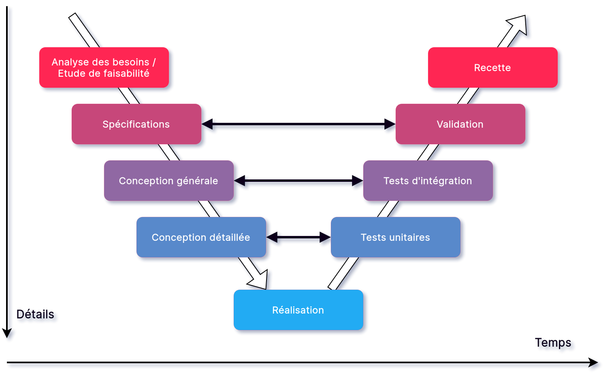
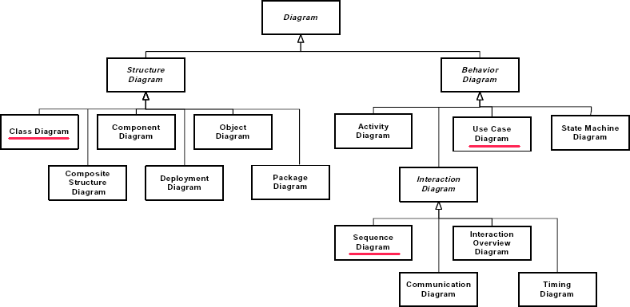
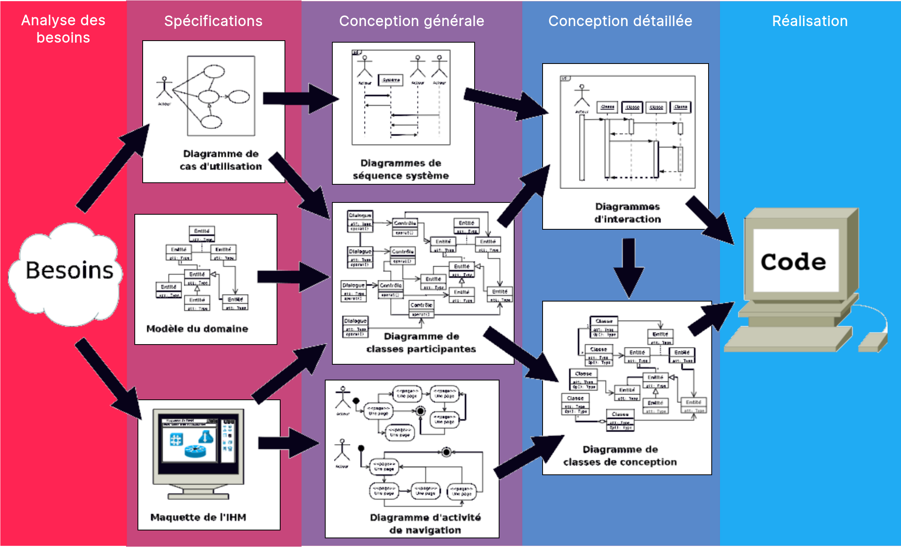

<!-- PARTIE 0 : Présentation du cours -->

<!-- _paginate: skip -->
<!-- _class: cover -->

Programmation Orientée Objet en Python

#5 UML (class diagram)

par David Albert

2023

--- 
<!-- TABLE DES MATIERES -->

## Table des matières 

<b>01  Introduction à UML</b>
Motivations. UML. Cycle de développement. Diagrammes. 

<b>02  Diagramme de cas d'utilisation</b>
Quelques exemples.

<b>03  Diagramme de classes</b>
Typing. Documentation. Gestion des erreurs. Tests unitaires.

---

<!-- _class: bg2 -->

## Cycle en V

Besoin de conception pour réaliser une architecture complexe.

---

## **U**nified **M**odeling **L**anguage 

<b class='important'>UML</b> c'est quoi ?
- un langage de modélisation de systèmes informatiques
- modèle graphique (à base de pictogrammes)
- indépendant du langage de programmation
- intervient dans la phase de conception (générale et détaillée)

---

<!-- _class: bg2 -->

<i class='block-icon fas fa-info'></i>

**Fun fact** : UML est décrit en UML. 

---

<!-- _class: bg2 -->

## Quelques diagrammes 

# Diagrammes structurels

<b class='important'>Diagramme de classes</b>
Définit l’ensemble des classes et de leurs relations

**Diagramme de composants**
Liste les composants logiciels

**Diagramme de déploiement**
Définit la répartition des composants sur une
architecture matérielle

# Diagrammes de comportement

<b class='important'>Diagramme des cas d'utilisation</b>
Définit les scénarios d’interaction entre les utilisateurs et le système

**Diagramme d'activité**
Représente les états du système et leurs transitions par événements

<b class='important'>Diagramme de séquence</b>
Représente les scénarios d’interactions entre entités du système

 
 

Référence: [Laurent Vercouter, Cours UML, Insa Rouen](https://pagesperso.litislab.fr/lvercouter/teaching/)

---

## Chaîne de conception

Différents diagrammes arrivent à différents moments dans la chaîne de conception.

Référence: 
[Laurent Audibert](https://laurent-audibert.developpez.com/Cours-UML/?page=mise-en-oeuvre-uml)

---

<!-- PARTIE 02 : Cas d'utilisation -->

# 02

## Cas d'utilisation

---

<!-- _class: bg1 -->

## Diagramme de cas d'utilisation 

<b class='important'>Objectifs</b>

