<!-- PARTIE 0 : Présentation du cours -->

<!-- _paginate: skip -->
<!-- _class: cover -->

Programmation Orientée Objet en Python

#5 UML (class diagram)

par David Albert

<!--  -->

2023

--- 
<!-- TABLE DES MATIERES -->

## Table des matières 

<b>01  Cycles de développement</b>
Cycle en V et méthodes AGILE. 

<b>02  Introduction à UML</b>
Motivations. Diagrammes. Chaîne de conception. 

<b>03  Diagramme de cas d'utilisation</b>
Quelques exemples.

<b>04  Diagramme de classes</b>
Typing. Documentation. Gestion des erreurs. Tests unitaires.

---

<!-- PARTIE 01 : Cycles de développement -->

# 01

## Cycles de développement

---

<!-- _class: bg2 -->

## Cycle en V

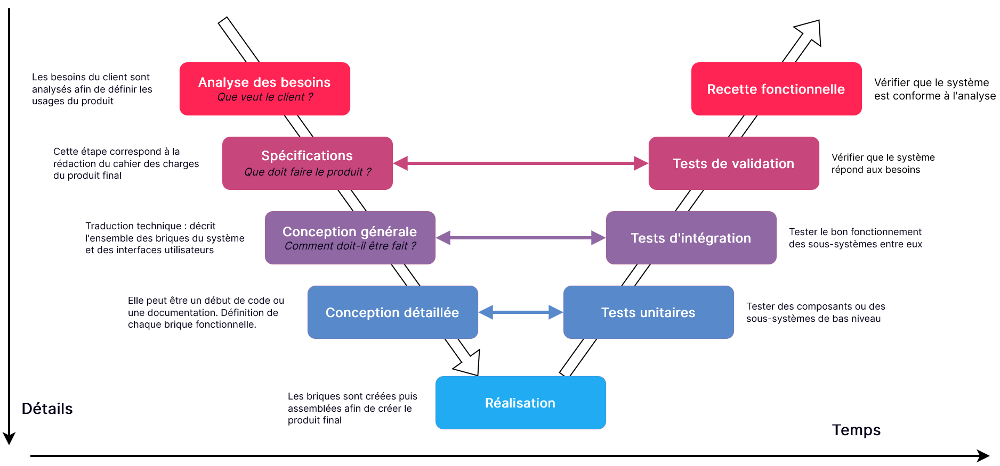

---

## Vers une méthodologie **AGILE**

<i class='block-icon fas fa-exclamation'></i>

Le **cycle en V** a un **inconvénient majeur**. La vérification de la conformité aux besoins client attend la fin du développement du produit. S'il y a un soucis, on s'en rend compte **très tardivement**.

**Méthologie AGILE**
Pour pallier à cela, les entreprises privilégient de plus en plus des **cycles courts** et successifs. On répétera successivement les étapes de *spécifications, conception, développement, test et validation*.
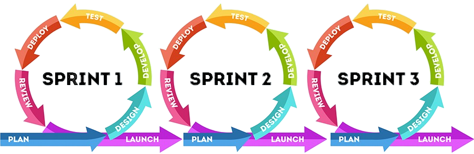

---

<!-- PARTIE 02 : Introduction à UML -->

# 02

## Introduction à UML

---

## **U**nified **M**odeling **L**anguage 

**Motivations**
- Besoin de conception pour réaliser une architecture complexe.
- Besoin de se comprendre 

<b class='important'>UML</b> c'est quoi ?
- un langage de modélisation de systèmes informatiques
- modèle graphique (à base de pictogrammes)
- indépendant du langage de programmation
- intervient dans la phase de conception (générale et détaillée)

---

<!-- _class: bg2 -->

<i class='block-icon fas fa-info'></i>

**Fun fact** : UML est décrit en UML. 

---

<!-- _class: bg2 -->

## Quelques diagrammes 

# Diagrammes structurels

<b class='important'>Diagramme de classes</b>
Définit l’ensemble des classes et de leurs relations

**Diagramme de composants**
Liste les composants logiciels

**Diagramme de déploiement**
Définit la répartition des composants sur une
architecture matérielle

# Diagrammes de comportement

<b class='important'>Diagramme des cas d'utilisation</b>
Définit les scénarios d’interaction entre les utilisateurs et le système

**Diagramme d'activité**
Représente les états du système et leurs transitions par événements

<b class='important'>Diagramme de séquence</b>
Représente les scénarios d’interactions entre entités du système

 
 

Référence: [Laurent Vercouter, Cours UML, Insa Rouen](https://pagesperso.litislab.fr/lvercouter/teaching/)

---

## Chaîne de conception

Différents diagrammes arrivent à différents moments dans la chaîne de conception.

Référence: 
[Laurent Audibert](https://laurent-audibert.developpez.com/Cours-UML/?page=mise-en-oeuvre-uml)

---

<!-- PARTIE 03 : Cas d'utilisation -->

# 03

## Diagramme de cas d'utilisation

---

## Etude de cas

### **Gestion d'un restaurant**

On souhaite réaliser une application pour un restaurant qui lui permettra de gérer les réservations et les commandes de ses clients.  

<i class='block-icon fas fa-info'></i>

# On utilisera cet exemple comme fil rouge tout au long de ce cours. 

**Enoncé détaillé**
Le restaurant accueille des clients décrits par un nom, un email et un numéro de téléphone. Le restaurant est ouvert tous les jours de 19h et 23h30 durant lequel il peut accueillir au maximum 20 clients par service (1 service dure 1h30). Les clients peuvent réserver une table sur ces créneaux. S'il n'y a plus de place, ils peuvent également commander leur repas et payer via l'application et venir le récupérer dans la foulée. Sur place, un serveur s'occupera de des commandes des clients et de la paie.   

---

<!-- _class: bg1 -->

## Diagramme de cas d'utilisation 
### **Résumé**

**Objectifs**

- Premier diagramme réalisé pour définir les scénarios d’usage
- A réaliser avec le client
- À utiliser tout au long du développement

**Exemple**

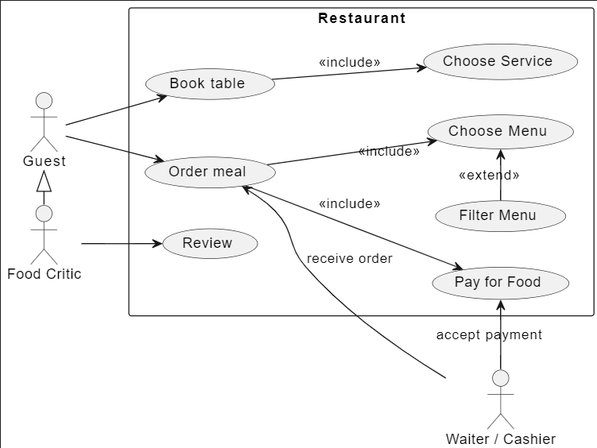

---

## Diagramme de cas d'utilisation
### **Syntaxe**

<i class='block-icon fas fa-hand'></i>

# Déclenchement

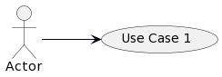

<i class='block-icon fas fa-arrow-right'></i>

# Prolongement

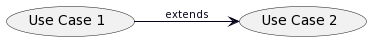

<i class='block-icon fas fa-check'></i>

# Pré-requis

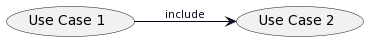

<i class='block-icon fas fa-child'></i>

# Héritage

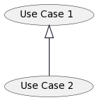

---

<!-- PARTIE 04 : Maquettes -->

# 04

## Maquettes

---

## Réaliser les premières maquettes

Rien de tel que quelques maquettes pour mettre tout le monde d'accord sur l'interface homme-machine et ses interactions.

**Outils:** [drawio](https://app.diagrams.net/) et [Figma](https://www.figma.com/)

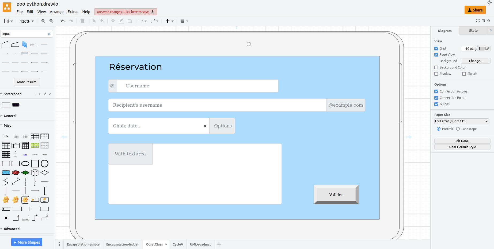
<!-- 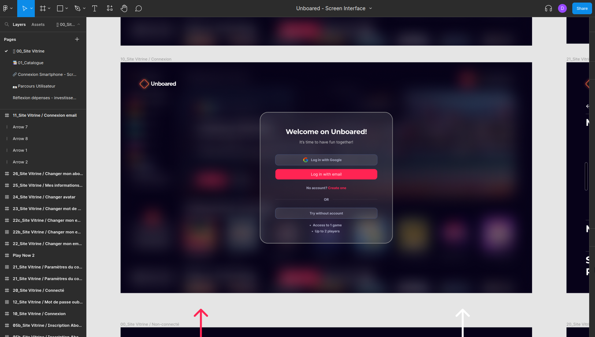 -->

---

<!-- PARTIE 05 : Diagramme de classes -->

# 05

## Diagrammes de classes

---

## Diagramme de classes 
### **Syntaxe 1**

<!-- <i class='block-icon fas fa-'></i> -->

# Classe

**Attributs** 
*[+/-] attr : Type* 

**Méthodes**
*[+/-] method(param: Type): ReturnType* 

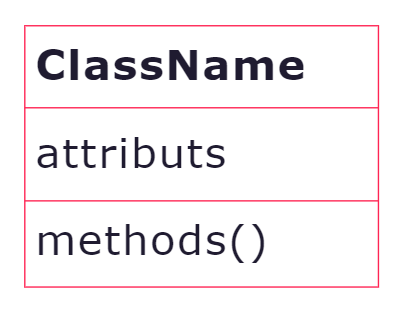

<b class='important'>+</b> attributs **publics**
<b class='important'>-</b> attributs **privés**

# Interface et classes abstraites

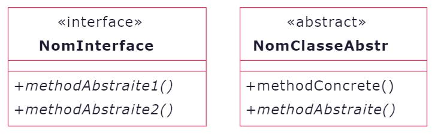

Méthodes abstraites en *italic* (ou <u>soulignée</u>)

# Héritage
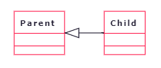

---

## Diagramme de classes 
### **Syntaxe 2**

# Association
Si deux classes sont en intéractions dans le système on les associent.

 

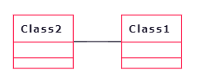

On peut préciser la multiplicité.

# Aggrégation / Composition

- associations particulières
- On peut dire: "objet de la classe 1 <u>contient</u> objet(s) de la classe 2"

**Composition**
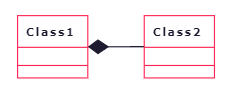

 

Contient physiquement
*Class1* détruite <i class='fas fa-arrow-right'></i> *Class2* détruite

**Aggrégation**
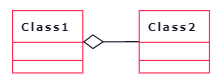

 

*Class1* détruite <i class='fas fa-arrow-right'></i> *Class2* persiste

 

---

## **Modèle du domaine**

**Phase**
Début de conception générale. Intervient juste après les premières maquettes et cas d'utilisation.

**Objectifs**
- Premier diagramme de classes à réaliser
- Indépendant des fonctionnels de l’application
- Représente le domaine métier

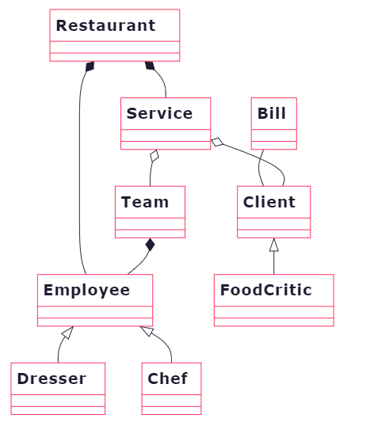

---

## **Diagramme de classes participantes**

**Phase**
Fin de conception générale. Intervient dans la dernière phase de la conception générale en même temps que les diagrammes de séquence et d'activité.

**Objectifs**

- Enrichissement du modèle de domaine
- Modélisation guidée par les besoins

---

<!-- PARTIE 05 : Diagramme d'activité -->

# 06

## Diagramme d'activité

---

<!-- PARTIE 06 : Diagrammes de séquence -->

# 07

## Diagrammes de séquence

<!-- 
 -->