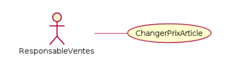

<!-- PARTIE 0 : Présentation du cours -->

<!-- _paginate: skip -->
<!-- _class: cover -->

Programmation Orientée Objet en Python

#5 UML Functional Diagrams

par David Albert

2023

<!-- TABLE DES MATIERES -->

---

## Table des matières

<b>01  Diagramme de séquences</b>
Syntaxe. Exemples.

<b>02  Synthèse COO</b>
Modélisation complète des interactions.

---

<!-- PARTIE 01 : Diagrammes de séquences -->

# 01

## Diagrammes de séquences

---

## **Diagrammes de séquences**

**Phase**
Fin de conception générale et pendant la conception détaillée.

**Objectifs**

- Représenter les interactions entre différents objets

---

## Diagrammes de séquences

---

## Diagrammes de séquences

---

## Diagramme de séquences

### **Syntaxe**

# Ligne de vie

**Acteur**
Ligne de vie d'un acteur du système.

**Objets**
Ligne de vie d'un objet du système.

# Messages

**Envoi de message**
<u>_Exemples :_</u>
appeler("Mozart", 510)
afficher(x,y)
initialiser(x=100)

**Retour de message**
<u>_Exemples :_</u>
age
name="Mark"
"Summer"

---

## Diagramme de séquences

### **Syntaxe**

# opt

Contient une séquence qui peut ou non se produire.

# alt

Contient des alternatives à une séquence de messages.

# loop

Le fragment est répété un certain nombre de fois.

---

## Diagramme de séquences

**Exemple**

---

<!-- PARTIE 02 : Synthèse COO -->

# 02

## Synthèse COO

---

## Synthèse conception orientée objet

Les **diagrammes de cas d’utilisation** modélisent à **QUOI** sert le système, en organisant les interactions possibles avec les acteurs.

Les **diagrammes de classes** permettent de spécifier la structure et les liens entre les objets dont le système est composé : ils spécifient **QUI** sera à l’oeuvre dans le système pour réaliser les fonctionnalités décrites par les diagrammes de cas d’utilisation.

Les **diagrammes de séquences** permettent de décrire **COMMENT** les éléments du système interagissent entre eux et avec les acteurs :

- Les objets au coeur d’un système interagissent en s’échangent des messages.
- Les acteurs interagissent avec le système au moyen d’IHM (Interfaces Homme-Machine).

---

## Synthèse conception orientée objet

Pour être complètement spécifiée, une interaction doit être décrite dans plusieurs diagrammes UML:

- Cas d’utilisation
  

- Classes pour spécifier les opérations nécessaires

- Séquences
  

