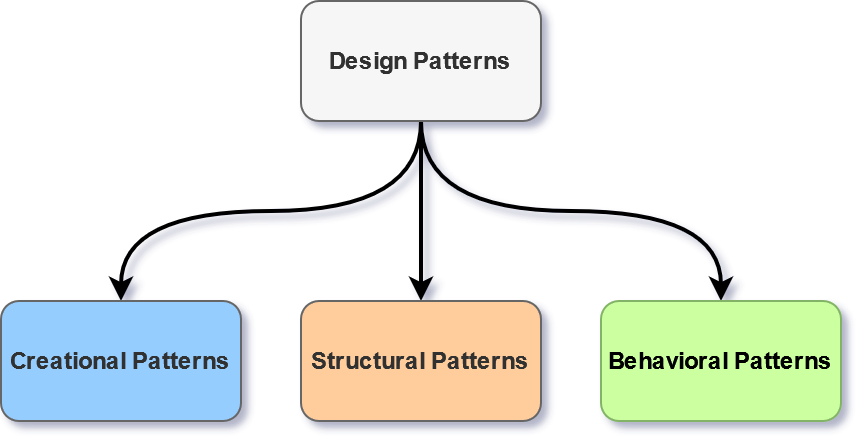
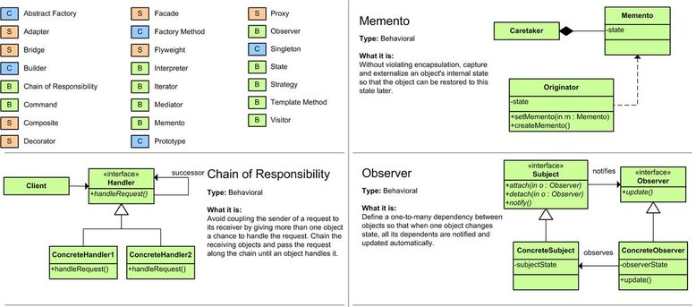
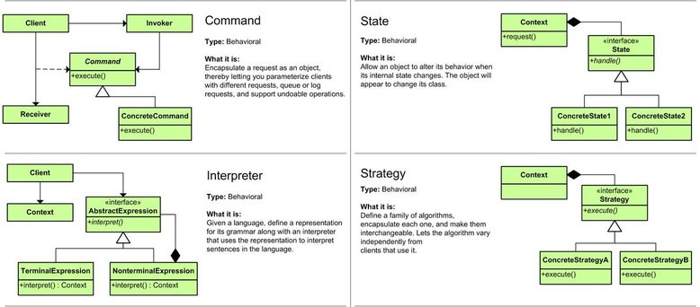
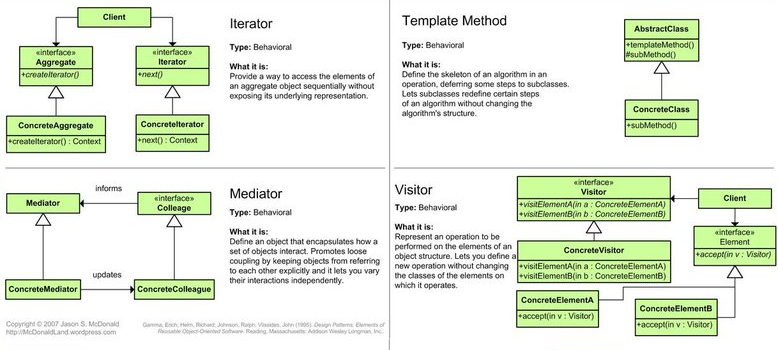
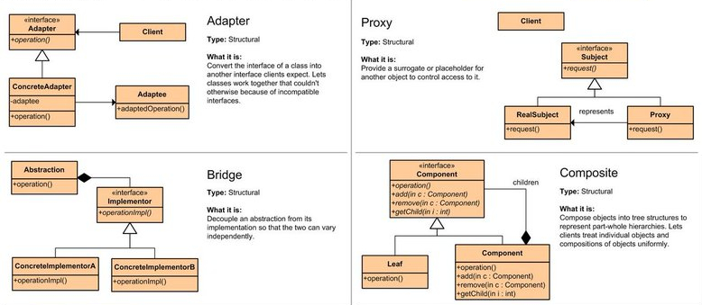
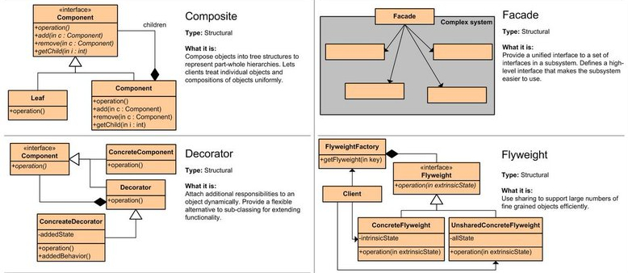
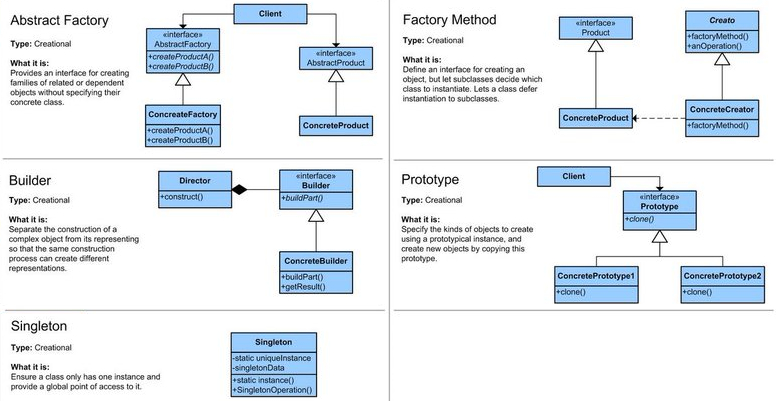

<!-- PARTIE 0 : Présentation du cours -->

<!-- _paginate: skip -->
<!-- _class: cover -->

<div class="coverBlockCenter">
<div class="coverModuleName">Programmation Orientée Objet en Python</div>
<div class="coverCourseName"><span class="important">#6 </span>POO Avancée</div>
<div class="coverAuthor">par <span class="important">David Albert</span></div>
</div>


<div class="coverYear coverFooterRight">2023</div>

<!-- TABLE DES MATIERES -->

---

## Table des matières

<b><span class="important">01 </span> SOLID principles</b>
Définition et explications.

<b><span class="important">02 </span> Design patterns</b>
Quelques exemples.

<b><span class="important">03 </span> Annexes</b>
Design patterns détaillés.

<!-- <b><span class="important">03 </span> Mieux coder en python</b>
Documentation. Gestion des erreurs. Tests unitaires. -->

---

<!-- PARTIE 01 : SOLID principles -->

<div class='main'>

# 01

## SOLID principles <i class='important'>\*</i>

</div>

<div style="position:absolute;bottom:10%">
<i class='important'>*</i>cette section reprend les exemples de <a href="https://gist.github.com/dmmeteo"><b class='important'>@dmmeteo</b></a> 
</div>

---

## **S**ingle responsability

**Explication**
Chaque classe / composant logiciel doit avoir une responsable unique.

<div class='flex-horizontal'><div class='flex'>
<h4 class="success">
<i class='fas fa-check'></i>
GOOD
</h2>

```python
class Animal:
    def __init__(self, name: str):
            self.name = name

    def get_name(self):
        pass


class AnimalDB:
    def get_animal(self) -> Animal:
        pass

    def save(self, animal: Animal):
        pass
```

</div><div class='flex'>
<h4 class="error">
<i class='fas fa-xmark'></i>
BAD
</h2>

```python
class Animal:
    def __init__(self, name: str):
        self.name = name

    def get_name(self) -> str:
        pass

    def save(self, animal: Animal):
        pass
```

<i class='fas fa-arrow-up'></i> Ici, la classe `Animal` a deux responsabilités: gérer la base de données et gérer les attributs.

</div></div>

---

## **O**pen-Closed

**Explication**
Chaque entité logiciel (classe, module, fonction) doit être ouverte à l'extension mais fermée à la modification.

<div class='flex-horizontal'><div class='flex'>
<h4 class="success">
<i class='fas fa-check'></i>
GOOD
</h2>

```python
class Discount:
    def __init__(self, customer, price):
        self.customer = customer
        self.price = price

    def get_discount(self):
            return self.price * 0.2


class VIPDiscount(Discount):
    def get_discount(self):
        return super().get_discount() * 2
```

</div><div class='flex'>
<h4 class="error">
<i class='fas fa-xmark'></i>
BAD
</h2>

```python
class Discount:
    def __init__(self, customer, price):
        self.customer = customer
        self.price = price

    def give_discount(self):
            if self.customer == 'fav':
                return self.price * 0.2
            if self.customer == 'vip':
                return self.price * 0.4
```

<i class='fas fa-arrow-up'></i> Ici, au moindre souhait d'ajouter un nouveau type de remise, on devra changer le code existant !

---

## Substitution de **L**iskov

**Explication**
Une sous-classe doit être substituable à sa super-classe. Le but est de s'assurer qu'une sous-classe peut prendre la place de sa super-classe sans erreur.

<div class='flex-horizontal'><div class='flex'>
<h4 class="success">
<i class='fas fa-check'></i>
GOOD
</h2>

```python
def animal_leg_count(animals: list):
    for animal in animals:
        print(animal.leg_count())

animal_leg_count(animals)
```

</div><div class='flex'>
<h4 class="error">
<i class='fas fa-xmark'></i>
BAD
</h2>

```python
def animal_leg_count(animals: list):
    for animal in animals:
        if isinstance(animal, Lion):
            print(lion_leg_count(animal))
        elif isinstance(animal, Mouse):
            print(mouse_leg_count(animal))
        elif isinstance(animal, Pigeon):
            print(pigeon_leg_count(animal))

animal_leg_count(animals)
```

<i class='fas fa-arrow-up'></i> Ici, le type de classe est vérifié, le principe de substitution de Liskov est donc violé !

---

## Séparation des **I**nterfaces

**Explication**
Fournir des interfaces simples et spécifiques. Ne pas contraindre la personne qui voudra étendre notre logiciel de dépendre d'interfaces qu'il n'utilise pas.

<div class='flex-horizontal'><div class='flex'>
<h4 class="success">
<i class='fas fa-check'></i>
GOOD
</h2>

```python
class IShape:
    def draw(self):
        raise NotImplementedError

class Circle(IShape):
    def draw(self):
        pass

class Square(IShape):
    def draw(self):
        pass

class Rectangle(IShape):
    def draw(self):
        pass
```

</div><div class='flex'>
<h4 class="error">
<i class='fas fa-xmark'></i>
BAD
</h2>

```python
class IShape:
    def draw_square(self):
        raise NotImplementedError

    def draw_rectangle(self):
        raise NotImplementedError

    def draw_circle(self):
        raise NotImplementedError
```

<i class='fas fa-arrow-left'></i> Ici, on pourra utiliser une combinaison de plusieurs interfaces pour créer des formes particulières: demi cercle, triancle rectangle, ...

---

## Inversion des **D**épendances

**Explication**
La dépendance doit porter sur les abstractions et non sur les concrétions.

<div class='flex-horizontal'><div class='flex'>
<h4 class="success">
<i class='fas fa-check'></i>
GOOD
</h2>

```python
class Connection:
    def request(self, url: str, options: dict):
        raise NotImplementedError

class Http:
    def __init__(self, http_connection: Connection):
        self.http_connection = http_connection

    def get(self, url: str, options: dict):
        self.http_connection.request(url, 'GET')

    def post(self, url, options: dict):
        self.http_connection.request(url, 'POST')

class XMLHttpService(Connection):
    xhr = XMLHttpRequest()
    def request(self, url: str, options:dict):
        self.xhr.open()
        self.xhr.send()
```

</div><div class='flex'>
<h4 class="error">
<i class='fas fa-xmark'></i>
BAD
</h2>

```python
class XMLHttpService(XMLHttpRequestService):
    pass

class Http:
    def __init__(self, xml_http_service: XMLHttpService):
        self.xml_http_service = xml_http_service

    def get(self, url: str, options: dict):
        self.xml_http_service.request(url, 'GET')

    def post(self, url, options: dict):
        self.xml_http_service.request(url, 'POST')

```

<i class='fas fa-arrow-up'></i> Ici, la classe de haut-niveau (http) dépend d'une implémentation spécifique pour le bas niveau et non d'une abstraction.

---

<!-- PARTIE 02 : Design patterns -->

<div class='main'>

# 02

## Design patterns

</div>

---

## Introduction

Les <b class='important'>patrons de conception</b> (design patterns) sont des solutions classiques à des problèmes récurrents de la conception de logiciels.

Chaque patron est une sorte de plan ou de schéma que vous pouvez personnaliser afin de résoudre un problème récurrent dans votre code.

Dans ce cours, nous présenterons 4 patrons de conception classiques.

<div class='block note'>

<i class='block-icon fas fa-info'></i>

# <b class='important'><a href="https://refactoring.guru/fr/design-patterns">Refactoring Guru</a></b> contient les explications de 22 patrons de conceptions classiques et leur utilisation.

</div>

---

## Types de patterns

<br/>



---

<h2>Factory Method  <span style="border-radius:10px; font-size:20px; font-weight:bold;padding:8px;background-color:#99ccff;">creational</span></h2>

La <b class='important'>"factory method"</b> permet de construire des objets depuis du texte.

**Exemple**

<div class='flex-horizontal'><div class='flex'>

```python
class FrenchLocalizer:
    """it simply returns the french version"""
    def __init__(self):
        self.translations = {"car": "voiture", "bike": "bicyclette"}

    def localize(self, msg):
        """change the message using translations"""
        return self.translations.get(msg, msg)

class SpanishLocalizer:
    """it simply returns the spanish version"""
    def __init__(self):
        self.translations = { "car": "coche", "bike": "bicicleta"}

    def localize(self, msg):
        """change the message using translations"""
        return self.translations.get(msg, msg)

class EnglishLocalizer:
    """Simply return the same message"""
    def localize(self, msg):
        return msg
```

</div><div class='flex'>

```python
# The factory
def TranslateFactory(language ="English"):

    """Factory Method"""
    localizers = {
        "French": FrenchLocalizer,
        "English": EnglishLocalizer,
        "Spanish": SpanishLocalizer,
    }

    return localizers[language]()
```

```python
f = Factory("French")
print(f.localize("car")) # voiture
```

</div></div>

---

<h2> Adapter <span style="border-radius:10px; font-size:20px; font-weight:bold;padding:8px;background-color:#ffcb99">structural</span></h2>

La méthode <b class='important'>"adapter"</b> permet de réutiliser le comportement fonctionnel d'une classe mais dont l'interface ne correspond pas aux attentes.

**Exemple**

<div class='flex-horizontal'><div class='flex'>

```python
class Target:
    """
    Interface utilisé par le code client.
    """
    def request(self) -> str:
        return "Target: The default target's behavior."

class Adaptee:
    """
    Contient des comportements utiles mais  l'interface
    ne correspond pas à l'interface existante.
    """
    def specific_request(self) -> int:
        return 12301384
```

</div><div class='flex'>

```python
class Adapter(Target):
    """
    L'adapteur permet de faire concorder la classe
    véhicule avec l'interface souhaitée.
    """
    def __init__(self, adaptee: Adaptee):
        self.__adaptee = adaptee

    def request(self) -> str:
        return "Adapted request : " +
            str(self.__adaptee.specific_request())
```

</div></div>

---

## Bridge <span style="border-radius:10px; font-size:20px; font-weight:bold;padding:8px;background-color:#ffcb99;">structural</span></h2>

Le méthode <b class='important'>"bridge"</b> permet de séparer une grosse classe ou un ensemble de classes connexes en deux hiérarchies — abstraction et implémentation — qui peuvent évoluer indépendamment l’une de l’autre.

**Exemple :**

<div class='flex-horizontal'><div class='flex'>

```python
from abc import ABC, abstractmethod

class Shape(ABC):
    def __init__(self, x: int, y: int, drawAPI: DrawAPI) -> None:
        self._x = x
        self._y = y
        self._drawAPI = drawAPI

    @abstractmethod
    def draw(self) -> None:
        pass

class Circle(Shape):
    def draw(self) -> None:
        self._drawAPI.draw_circle(color)
```

</div><div class='flex'>

```python
class DrawAPI(ABC):
    """ Définit l'interface de notre système de dessin. """
    @abstractmethod
    def draw_circle(self, x: int, y: int) -> None:
        pass

    @abstractmethod
    def draw_rectangle(self, x: int, y: int) -> None:
        pass

class ShellDrawAPI(DrawAPI):
    # ... impélemente DrawAPI pour un affichage en terminal ...

class TkinterDrawAPI(DrawAPI):
    # ... impélemente DrawAPI pour un affichage en via Tkinter ...
```

```python
api_type : DrawAPI = new ShellDrawAPI()
circle1 : Shape = new Circle(0, 0, api_type)
circle2 : Shape = new Circle(20, 10, api_type)
circle1.draw()
circle2.draw()
```

</div></div>

---

## Strategy <span style="border-radius:10px; font-size:20px; font-weight:bold;padding:8px;background-color:#cafd9e;">behavioral</span></h2>

La méthode <b class='important'>"strategy"</b> permet de définir une famille d’algorithmes, de les mettre dans des classes séparées et de rendre leurs objets interchangeables.

**Exemple :**

<div class='flex-horizontal'><div class='flex'>

```python
import random
from abc import ABC, abstractmethod

class SortStrategy(ABC):
    """
    L'interface Strategy déclare les opération communes
    à toutes les versions supportées d'un algorithme.
    """
    @abstractmethod
    def sort(self, data: List):
        pass

class StandardSort(SortStrategy):
    def sort(self, data: List) -> List:
        return sorted(data)

class ReverseSort(SortStrategy):
    def sort(self, data: List) -> List:
        return reversed(sorted(data))
```

</div><div class='flex'>

```python
class Context():
    def __init__(self, sort_strategy: SortStrategy) -> None:
        """
        Souvent, le contexte accepte la stratégie comme
        entrée du constructeur, mais fournit aussi un
        setter pour la modifier pendant l'exécution.
        """
        self._sort_strategy = sort_strategy

    def get_sort_strategy(self) -> SortStrategy:
        return self._sort_strategy

    def set_sort_strategy(self, sort_strategy: SortStrategy) -> None:
        self._sort_strategy = sort_strategy

    def do_some_business_logic(self) -> None:
        print("Context: Sorting data using the strategy (not sure how \it'll do it)")
        result = self._sort_strategy.sort(["a", "b", "c", "d", "e"])
        print(",".join(result))
```

```python
context = Context(new StandardSort())

context.do_some_business_logic() # a,b,c,d,e
context.set_sort_strategy(new ReverseSort())
context.do_some_business_logic() # e,d,c,b,a
```

</div></div>

---

<!-- PARTIE 04 : Annexes -->

<div class='main'>

# 03

## Annexes

</div>

---

## Annexes 1 : Patrons de conception

### Patterns de comportement



---

### Patterns de comportement

<br/>



---

### Patterns de comportement

<br/>



---

### Patterns structurels

<br/>



---

### Patterns structurels

<br/>



---

### Patterns de création


