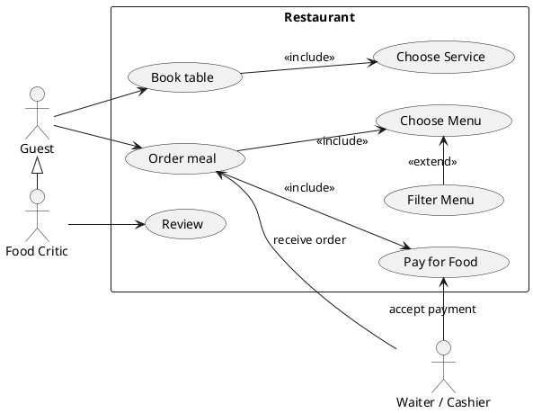

```plantuml
@startuml

left to right direction
actor "Guest" as guest
actor "Waiter / Cashier" as waiter
actor "Food Critic" as fc

rectangle Restaurant {
  usecase "Book table" as booktable
  usecase "Choose Service" as chooseservice
  usecase "Order meal" as ordermeal
  usecase "Choose Menu" as choosemenu
  usecase "Filter Menu" as filtermenu
  usecase "Pay for Food" as pay
  usecase "Review" as review
}

guest <|-r- fc

guest --> ordermeal
guest --> booktable

booktable -->  chooseservice:"<<include>>"
ordermeal --> "<<include>>" choosemenu
choosemenu <-l-  filtermenu:"<<extend>>"

ordermeal <--  waiter:"receive order"
waiter --> pay :"accept payment"


ordermeal -->  pay:"<<include>>"


fc --> review

@enduml
```

