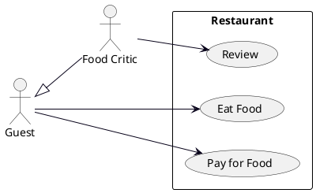

```plantuml
@startuml
skinparam class {
   FontSize 12
   FontName Impact
   FontColor #070219
   ArrowColor #070219
   BorderColor #070219
   BackgroundColor #ececec
   HeaderBackgroundColor #89a9da
}


skinparam component {
  ArrowFontSize 10
  ArrowFontName Inter
  ArrowFontColor #070219
}


skinparam package {
   FontSize 40
   FontName Inter
   BorderColor #000
   BackgroundColor #FFF
   HeaderBackgroundColor #89a9da
}

left to right direction
actor Guest as guest
actor "Food Critic" as fc

rectangle Restaurant {
  usecase "Eat Food" as eat
  usecase "Pay for Food" as pay
  usecase "Review" as review
}


guest --> eat
guest --> pay

fc --> review
guest <|-- fc
@enduml
```
