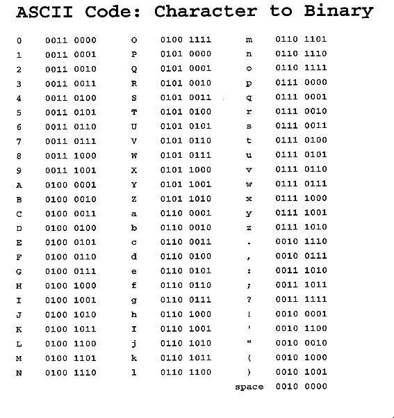

<!-- PARTIE 0 : Présentation du cours -->

<!-- _paginate: skip -->
<!-- _class: cover -->

<div class="coverBlockCenter">
<div class="coverModuleName">Informatique & Programmation</div>
<div class="coverCourseName"><span class="important">#3 </span>Programmation python</div>
<div class="coverAuthor">par <span class="important">David Albert</span></div>
</div>


<div class="coverYear coverFooterRight">2024</div>

<!-- TABLE DES MATIERES -->

---

<!-- _class: bg2 -->

## Table des matières

<b><span class="important">01 </span> Entrées / Sorties</b>
input. print.

<b><span class="important">02 </span> Types de données</b>
Booléens. Entiers. Flottants. Chaîne de caractères. Listes.

<b><span class="important">03 </span>Variables</b>
Déclaration d'une variable. Portée des variables.

<b><span class="important">04 </span> Commentaires</b>
Commenter son code.

---

<!-- PARTIE 01 : Entrées / Sorties -->

<div class='main'>

# 01

## Entrées / Sorties

</div>

---

## Entrées et Sorties

<div class='flex-horizontal'><div class='flex'>

**input**
Pour lire des entrées saisies par un utilisateur dans la console, on utilisera la fonction `input`.

_Exemple_

```python
  name = input()
  country = input("Quel est votre pays d'origine ?")
  age = int(input("Quel est votre age ?"))
```

</div><div class='flex'>

**output**
Pour afficher n'importe quel objet Python dans la console, on utilisera la fonction `print`.

_Exemple_

```python
  age = 35
  print("Age")
  print(age)
```

  </div></div>

<br/>

<div class='block note'>

<i class='block-icon fas fa-info'></i>

Il existe d’autres types d’entrées/sorties (fichier, réseau, base de données, ...). Nous les verrons plus tard.

</div>

---

<!-- PARTIE 01 : Type de données -->

<div class='main'>

# 02

## Type de données

</div>

---

## Types primitifs

</br>

<div class='flex-horizontal'><div class='flex'>

### **Les booléens**

**Nom :** `bool`

**Valeurs :** `True`, `False`

**Opérateurs booléens**

`and`, `or`, `not`

</div><div class='flex'>

### **Les entiers**

**Nom :** `int`

**Valeurs :** ..., -3, -2, -1, 0, 1, 2, 3, 4, ...

**Opérateurs de comparaison**

- égalité : `==`
- inégalité : `!=`
- infériorité : `<`, `<=`
- supériorité : `>`, `>=`

<div class='block note'>

<i class='block-icon fas fa-info'></i>

Les opérateurs de comparaisons retournent un booléen (`True` ou `False`).

</div></div>

---

## Types primitifs

### **Les flottants**

**Nom :** `float`

**Valeurs :** Permet de s'approcher d'une représentation des **nombres réels** (bien qu'incomplète).

**Opérateurs de comparaison**

- égalité : `==`
- inégalité : `!=`
- infériorité : `<`, `<=`
- supériorité : `>`, `>=`
<div class='block note'>

<i class='block-icon fas fa-info'></i>

Les opérateurs de comparaisons retournent un booléen (`True` ou `False`).

</div>

<!-- --- -->
<!--  -->
<!-- ## Les caractères -->
<!--  -->
<!-- <div class='flex-horizontal'><div class='flex'> -->
<!--  -->
<!-- **Valeurs :** `'A'`, `'B'`, `'C'`, `';'`, `'!'`, `'0'`, `'1'`, ... -->
<!--  -->
<!-- **Représentation en machine** -->
<!--  -->
<!-- - [**Code ASCII**](https://fr.wikipedia.org/wiki/American_Standard_Code_for_Information_Interchange) -->
<!-- - [**unicode**](https://fr.wikipedia.org/wiki/Unicode) -->
<!--  -->
<!-- <div class='block warning'> -->
<!--  -->
<!-- <i class='block-icon fas fa-exclamation'></i> -->
<!--  -->
<!-- Le type caractère unique n'existe pas en tant que tel en python. Chaque caractère déclaré est interpréter par python comme une chaîne de caractère (cf ci-dessous). -->
<!--  -->
<!-- </div> -->
<!--  -->
<!-- </div><div class='flex'> -->
<!--  -->
<!-- **Table ASCII** -->
<!--  -->
<!--  -->
<!--  -->
<!-- </div></div> -->
<!--  -->

---

## Types primitifs

### **Les chaînes de caractères**

**Nom :** `string`

**Définition :** Une liste de caractères.

**Exemples :**
`"Brice"`, `"la vie est belle !"`, `"#0$£ù%&-"`

**Caractères spéciaux**

- Saut de ligne : `\n`
- Tabulation : `\t`

**Formatage de texte**
En Python, on peut simplement formater du texte en faisant précédé la chaîne de caractère par le caractère `f`

<div class='flex-horizontal'><div class='flex'>

```python
age_min = 12
warning_msg = f"interdit aux moins de {age_min} ans"
```

</div><div class='flex'>

```python
score = 0.33333333
print(f"score à 2 décimal={age_min:.2}")
```

</div></div>

---

<!-- _class: bg2 -->

## Types primitifs

### **Les chaînes de caractères**

**Opérations classiques**
| Opérations | Exemples |
|:---: |:--- |
| assigner une variable | `my_str = "bidule"`|
| accès au 3ème caractère | `my_str[2]` |
| sous-chaîne | `my_str[:2]`, `my_str[1:]`, `my_str[1:2]`, `my_str[::2]` |
| longueur de la chaîne | `len(my_str)` |
| changer la casse | `my_str.capitalize()`, `my_str.upper()`, `my_str.lower()` |
| vérifier la casse | `my_str.islower()`, `my_str.isupper()`|
| concaténation | `"Hello " + "World"` (donnera `"Hello World"`) |
| répétition | `"la" * 5` (donnera `"lalalalala"`)|

---

## Types composites

### **Les listes**

**Nom :** `list`

**Définition :** Une liste ordonnée de données.

**Exemples :**
`[0, 21, 13, 7, 100]`, `[]`, `[True, True, False]`, ...

**Opérations classiques**

- assigner une variable : `l = []`
- accès au 3ème caractère : `l[2]`
- accès au dernier caractère : `l[-1]`
- sous-listes : `l[:2]`, `l[1:]`, `l[1:2]`, `l[::2]`
- ajout d'un élément à la fin : `l.append(3)`
- supprimer du 3ème élément : `l.remove(2)`
- tri d'une liste : `sorted(l)`

---

## Types composites

### **Les dictionnaires**

**Nom :** `dict`

**Définition :** Un dictionnaire est une structure de données qui assimile des clés à des valeurs.

**Exemples :**
`{"nom" : "Fred", "age" : 20 }`, `{}`, `{True : "eat", False : [0, 1, 2]}`, ...

**Opérateurs de bases**

- assigner une variable : `d = {}`
- accès à une valeur (depuis sa clé) : `d[key]`
- ajout d'un élément à la fin : `d[key] = value`
- supprimer du 3ème élément : `del d[key]`
- accès aux clés : `d.keys()`
- accès aux valeurs : `d.values()`
- accès aux couples (clé, valeurs) : `d.items()`

---

<!-- PARTIE 01 : Nom section -->

<div class='main'>

# 03

## Variables

</div>

---

<!-- _class: bg2 -->

## Qu'est-ce qu'une variable ?

<div class='block note'>

<div class='block-icon'>
<i class='far fa-heart' style='padding-right:1rem;'></i>
<b>Définition - Variable</b>
</div>

En informatique, les variables sont des symboles qui associent un nom (**l'identifiant**) à une **valeur**. Dans la plupart des langages, **les variables peuvent changer de valeur au cours du temps**.

De plus, **les variables ont un type** de valeur.

</div>

En python, la déclaration d'une variable se fait avec l'opérateur d'allocation `=`

**Exemples :**

```python
prenom = "Jonathan"          # variable de type chaîne de caractères (str)

age = 23                     # variable de type entier (int)

moyenne = 10.8               # variable de type flottant (float)

notes = [16, 12, 13, 9]      # variable de type liste d'entiers (list[int])
```

---

## Convention de nommage

**Nommage des variables**
Par convention en python, un nom de variable commence par une lettre minuscule puis les différents mots sont séparés par un tiret bas (tiret du 8).

_Exemples :_ `distance`, `distance_max`, `consigne_courante`, `etat_bouton_gauche_souris`

**Nommage des constantes**
Par convention en python, un nom de constante est en majuscule.

_Exemple :_ `MAX_PLAYERS`, `HEIGHT`, `WIDTH`, ...

**Mots réservés**
Les mots réservés sont les mots prédéfinis du langage python.
Ils ne peuvent pas être réutilisés pour des identifiants.

_Exemples :_ `for`, `while`,`if`, `return`, `None`, ...

---

## Portée des variables

La portée (scope) d’un identifiant (variables, fonctions, ...) est l’étendue au sein de laquelle cet identifiant est lié.

En python, la portée peut être globale (en dehors de tout bloc d'indentation) ou locale (au bloc courant).

**Portée des variables (globale / locale)**

```python
var1 = 10 # var1 est globale

def foo(var2): # var2 est locale
    var3 = 30 # var3 est locale
    if (var3 > 0):
        var4 = 40
        print(var1, var2, var3, var4) # 10, 20, 30, 40

    print(var1, var2, var3, var4) # 10, 20, 30, Erreur

foo(20)
print(var1, var2, var3, var4) # 10, Erreur, Erreur, Erreur


```

---

<!-- PARTIE 04 : Packages  -->

<div class='main'>

# 04

## Commentaires

</div>

---

<!-- _class: bg2 -->

## Commenter son code

**Pourquoi ?**
Les commentaires permettent d'expliquer succinctement certains portions de notre code.

**Comment ?**
Pour commenter une ligne ou une fin de ligne en python, on utilise le symbole **#**

_Exemple_

```python
# Cette ligne est un commentaire
nom = "Franc" # ici aussi c'est un commentaire
```

<div class='block note'>

<i class='block-icon fas fa-info'></i>

Les commentaires doivent aider à comprendre le code. On ne répète pas simplement une ligne.

<div class='flex-horizontal'><div class='flex'>

**✅ Bon commentaire**

```python
x = x + 4 # increase the border width
```

⬆️ Ce commentaire aide à la compréhension du code.

</div><div class='flex'>

**:x: Mauvais commentaire**

```python
x = x + 4 # increase x by 4
```

⬆️ Ce commentaire est inutile.

</div></div>

</div>
