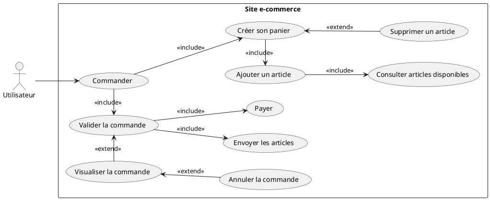

```plantuml
@startuml

left to right direction
actor Utilisateur as user

rectangle "Site e-commerce" {
  usecase "Commander" as commande
  usecase "Créer son panier" as panier
  usecase "Ajouter un article" as add
  usecase "Supprimer un article" as supp
  usecase "Consulter articles disponibles" as view_articles
  usecase "Visualiser la commande" as view_commande
  usecase "Valider la commande" as validate
  usecase "Annuler la commande" as cancel
  usecase "Payer" as pay
  usecase "Envoyer les articles" as send_articles
}

user --> commande
commande --> panier : "<<include>>"
panier -left-> add : "<<include>>"
panier <-- supp : "<<extend>>"
add --> view_articles : "<<include>>"
commande -left-> validate : "<<include>>"
view_commande <-- cancel : "<<extend>>"
validate <-left- view_commande : "<<extend>>"
validate --> send_articles : "<<include>>"
validate --> pay : "<<include>>"

@enduml
```
